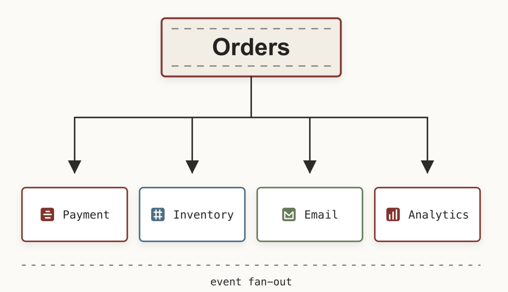
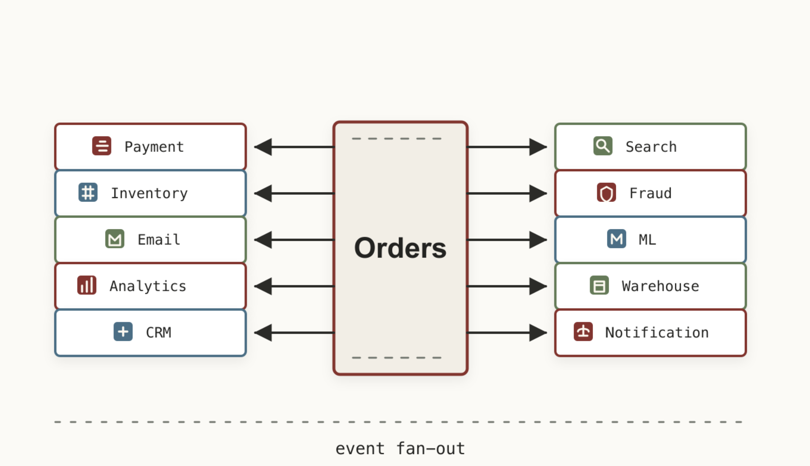
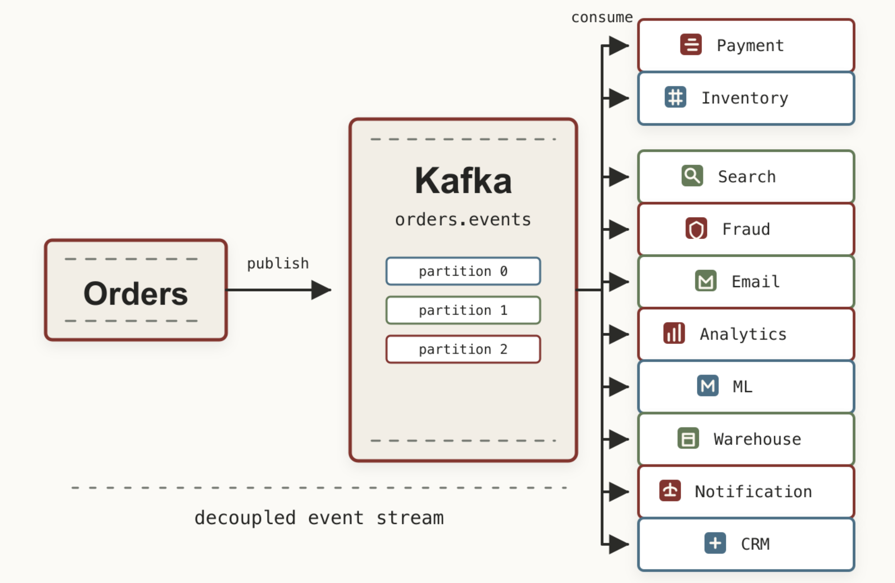
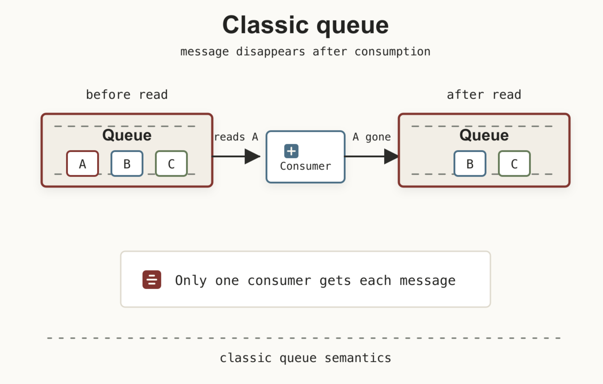
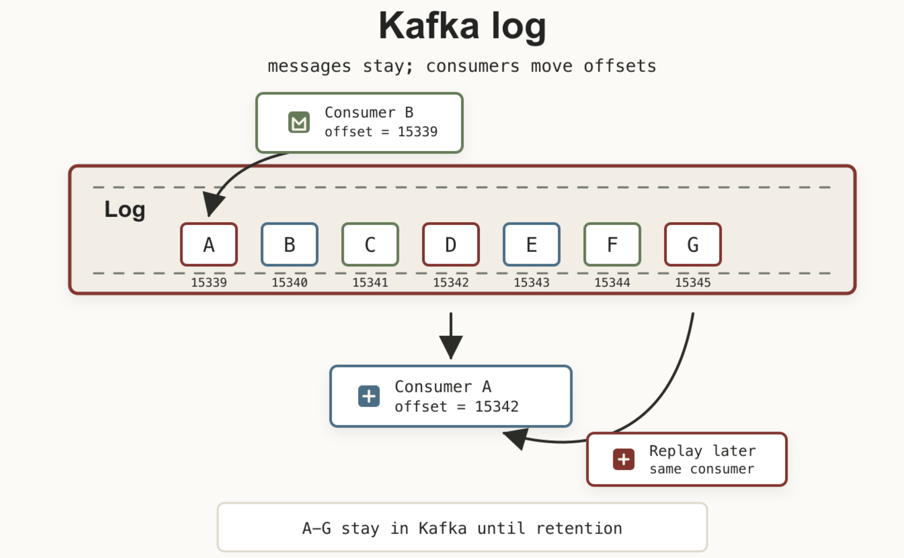

Если сегодня открыть архитектуру практически любой крупной IT-компании – Aviasales, Uber, Avito, Яндекс или Ozon – почти наверняка где-нибудь между микросервисами окажется Kafka. Иногда аккуратно, иногда как тот самый провод под столом, который все боятся трогать, потому что «оно же работает».

Kafka давно перестала быть просто брокером сообщений и стала фундаментом современных распределённых систем.

Эта серия статей – подробное руководство по Kafka. Мы не только разберём основные компоненты, но и поймём, почему Kafka настолько быстрая, как она обеспечивает отказоустойчивость и какие вопросы чаще всего задают на собеседованиях.

## Что такое Kafka

Apache Kafka – это распределённая платформа потоковой передачи событий (Distributed Event Streaming Platform).

Если говорить простыми словами, Kafka – это огромный журнал событий, в который одни приложения записывают сообщения, а другие их читают. Большинство новичков представляет Kafka как очередь – на самом деле не совем верно. Правильнее думать о Kafka как о распределённом журнале событий, каждое сообщение которого постоянно дописываются в конец. Например:

```text
----------------------------------
User Registered
Order Created
Payment Success
Email Sent
Product Viewed
Review Added
----------------------------------
```

Но этим её возможности не ограничиваются.

Kafka умеет:

- передавать данные между микросервисами;
- хранить события длительное время;
- масштабироваться практически бесконечно;
- выдерживать миллионы сообщений в секунду;
- восстанавливаться после отказа серверов.

Именно поэтому Kafka используется не только как очередь сообщений, но и как центральная шина данных всей компании. 

## Почему не HTTP?

Представим интернет-магазин.

Когда пользователь оформляет заказ, необходимо:

- списать деньги;
- уменьшить остаток товара;
- отправить письмо;
- начислить бонусы;
- обновить аналитику;
- отправить уведомление в мобильное приложение.

Самое очевидное решение выглядит так – сервис заказов вызывает каждый сервис напрямую:



Поначалу всё отлично. Демка работает, бизнес доволен, никто ещё не произнёс слово «интеграция» с болью в голосе. Но проходит полгода и появляются ещё сервисы:



Получается классическая проблема сильной связанности (tight coupling): один сервис знает слишком много о чужой жизни и начинает вести себя как слишком любопытный сосед.

Любое изменение затрагивает множество сервисов. Любая временная недоступность одного из них начинает ломать всю систему. И дай Бог  в вашей компании будут люди, которые смогут в Make architecture great again и смогут внедрить Kafka. 

Теперь сервис заказов больше никого не вызывает. Он просто публикует событие, а уже остальные сервисы самостоятельно подписываются на это событие. Пусть вас не пугает эта схема – мы дальше подробно остановимся на том как это работает на самом деле в следующих частях данного цикла.



Получается несколько преимуществ сразу.

1. Сервис заказов вообще не знает, кто будет читать событие.
2. Можно добавить новый сервис без изменения существующего кода.
3. Если один из сервисов временно недоступен, остальные продолжают работать.

Именно эта слабая связанность сделала Kafka настолько популярной.

## Когда Kafka действительно нужна

Вы должны четко понимать, что любое усложнение и изменение архитектуры должно быть оправданным. Очень часто Kafka пытаются использовать абсолютно везде и это ошибка. 

Напомню, что важно всегда следовать принципу [KISS](https://ru.wikipedia.org/wiki/KISS_(%D0%BF%D1%80%D0%B8%D0%BD%D1%86%D0%B8%D0%BF)).

Kafka отлично подходит, если:

- данные должны читать множество сервисов;
- необходима асинхронная обработка;
- требуется переживать пики нагрузки;
- важен журнал всех событий;
- нужно иметь возможность воспроизвести события с какого то момента;
- нагрузка достигает миллионов сообщений.

Например:

- оформление заказов;
- банковские транзакции;
- логирование;
- аналитика;
- телеметрия;
- IoT;
- стриминг.

Если же у вас:

- небольшой интернет-магазин;
- CRM на 20 пользователей;
- простой REST API;
- монолит без высокой нагрузки,

Kafka почти наверняка окажется лишней – во многих случаях достаточно RabbitMQ или вообще обычной PostgreSQL. А использование Kafka оправдано тогда, когда появляются реальные проблемы масштабирования, а не «на будущее».

## Первое фундаментальное отличие от очередей

В классической очереди сообщение исчезает после обработки.



В Kafka всё иначе. Consumer лишь говорит: Я прочитал до сообщения №15342. Само сообщение остаётся, поэтому другой Consumer может прочитать его позже.



Ну и тот же Consumer может начать читать историю заново и именно это делает возможными:

- Event Sourcing — подход, при котором Kafka хранит не только текущее состояние объекта, а последовательность событий, которые к нему привели. Например: OrderCreated → PaymentReceived → OrderShipped. Текущее состояние можно восстановить, проиграв события по порядку.
- Replay — возможность повторно прочитать старые сообщения из Kafka. Consumer может изменить offset и заново обработать события. Полезно после исправления бага, изменения бизнес-логики или для построения нового представления данных из истории.
- Stream Processing — обработка событий в реальном времени по мере их поступления. Например: Kafka → Flink/Kafka Streams → агрегация платежей за последние 5 минут → новый Kafka topic. Используется для фильтрации, агрегации, enrichment, join'ов и вычислений над потоками.
- CDC (Change Data Capture) — перенос изменений из базы данных в Kafka. Например, Debezium читает PostgreSQL WAL/MySQL binlog и публикует INSERT/UPDATE/DELETE в Kafka. Другие системы могут реагировать на изменения БД без постоянного polling базы.
- Аналитические системы — Kafka часто выступает транспортным слоем между источниками данных и аналитическим хранилищем. Например: микросервисы → Kafka → ClickHouse. Это позволяет собирать большие потоки событий, независимо масштабировать producers/consumers и строить near-real-time аналитику.

## Первые термины Kafka

Перед тем как разбираться с внутренним устройством, давайте познакомимся с основными сущностями, чтобы нам говорить на одном языке.

`Broker – это обычный сервер Kafka` На нём лежат данные, на нём работают клиенты, на нём хранятся журналы сообщений. Обычно брокеров несколько и чем больше брокеров – тем больше производительность и выше отказоустойчивость.

`Producer – приложение, которое отправляет сообщения` Это может быть:

- backend;
- мобильное приложение;
- касса магазина;
- банкомат;
- IoT-датчик.

`Topic – это логическая категория сообщений` Producer пишет сообщение не на конкретный сервер – он пишет в Topic. А где именно окажется сообщение – Kafka решит сама.

Например:

- `orders`
- `payments`
- `notifications`
- `users`

`Consumer – приложение, которое читает сообщения` Самый простой пример – сервис рассылки уведомлений по созданному заказу. 

Последнее, что нужно знать на данный момент: Producer и Consumer вообще ничего не знают друг о друге – они знают только Topic.

---

На этом месте остановимся. Базовые сущности уже на столе, теперь можно перестать смотреть на Kafka как на «ещё одну очередь» и перейти к механике.

В следующей части разберём `Partition` – механизм, который позволяет Kafka масштабироваться, не превращая порядок сообщений в лотерею. Затем рассмотрим `Consumer Groups` и соберём первую полноценную архитектуру Kafka.
