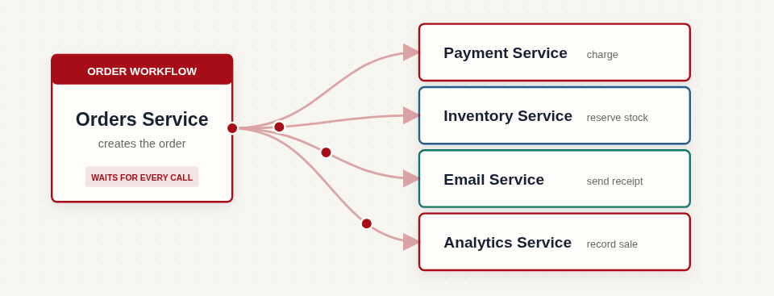
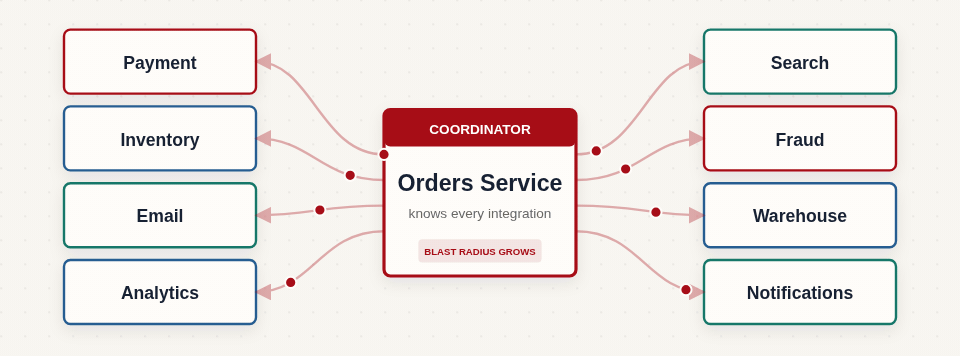
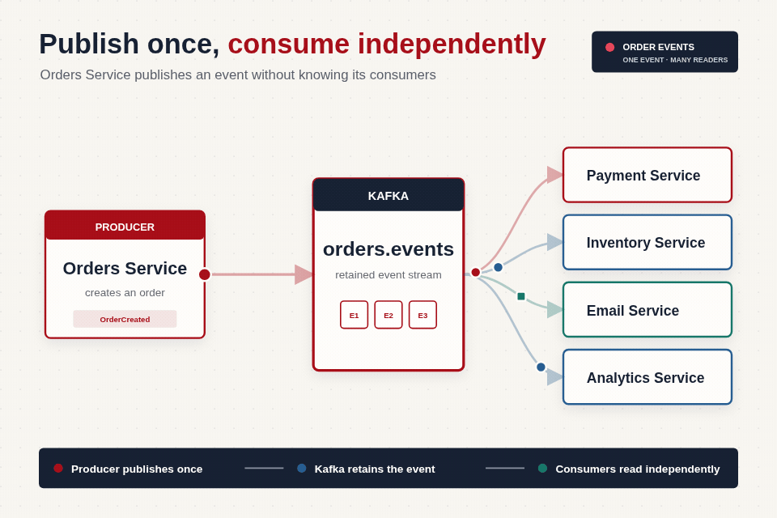
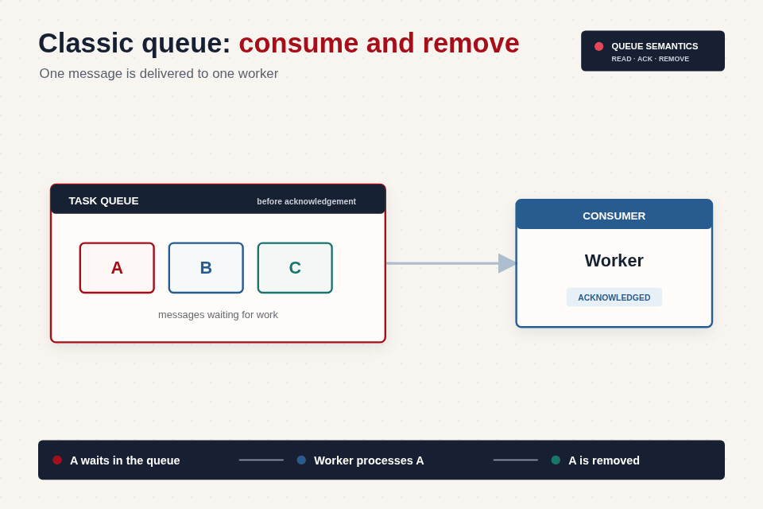
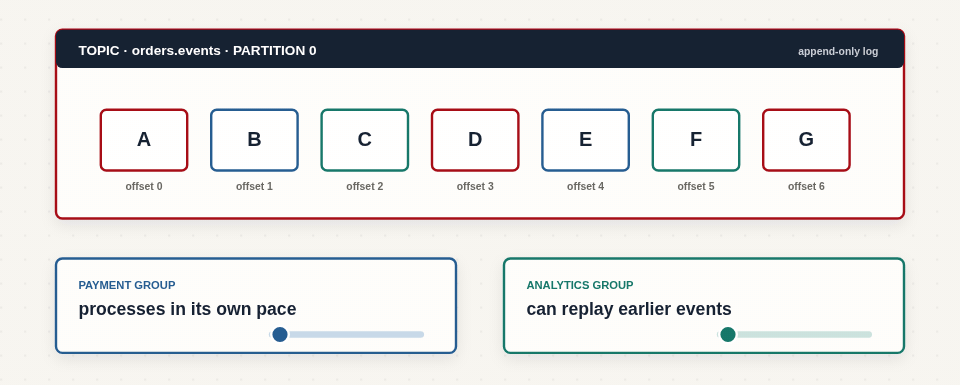

Если посмотреть на архитектуру крупной IT-компании — Aviasales, Uber, Avito, Яндекс или Ozon — с большой вероятностью где-нибудь между сервисами окажется Kafka. Иногда аккуратно встроенная в платформу данных, иногда как критичный компонент, который все боятся трогать, потому что «оно же работает».

Kafka используют не только для обмена сообщениями, но и как основу потоков данных в распределённых системах.

В этой серии я хочу не просто перечислить компоненты Kafka, а помочь вам собрать цельную картину: зачем она нужна, как работает и где заканчиваются её гарантии. Мы с вами пройдём этот путь на примере интернет-магазина — от первого события о заказе до обработки сбоев в production.

> Серия ориентирована на современные версии Apache Kafka 3.x и 4.x. Базовые принципы — Topic, Partition, Producer, Consumer, Offset, Consumer Group, репликация и retention — актуальны для обеих веток. Там, где речь идёт об эксплуатации кластера, я ориентируюсь на Kafka 4.x и KRaft, а не на устаревший ZooKeeper-режим.

## Что такое Kafka

Apache Kafka — это распределённая платформа потоковой передачи событий (Distributed Event Streaming Platform).

Если говорить простыми словами, Kafka — это распределённый журнал событий: одни приложения записывают в него сообщения, а другие читают их в своём темпе. Большинство новичков представляет Kafka как обычную очередь, но это только часть картины. Правильнее думать о Kafka как о логе, куда новые записи постоянно добавляются в конец. Например:

```text
----------------------------------
User Registered
OrderCreated
PaymentCompleted
Email Sent
Product Viewed
Review Added
----------------------------------
```

Но этим её возможности не ограничиваются.

Kafka умеет:

- передавать данные между микросервисами;
- сохранять журнал событий для повторного чтения и восстановления;
- масштабироваться горизонтально под высокую нагрузку;
- выдерживать очень высокий поток сообщений;
- восстанавливаться после отказа серверов — подробнее разберём это далее.

Именно поэтому Kafka используют не только как очередь сообщений, но и как основу для событийных потоков между сервисами, аналитикой и хранилищами данных.

## Проблема прямых вызовов между сервисами

Представим себе классический интернет-магазин. Когда пользователь оформляет заказ, необходимо:

- списать деньги;
- уменьшить остаток товара;
- отправить письмо;
- начислить бонусы;
- обновить аналитику;
- отправить уведомление в мобильное приложение.

Самое очевидное решение выглядит так: сервис заказов вызывает каждый зависимый сервис напрямую.



Поначалу схема работает: сервисов немного, а прямые вызовы легко проследить. Но магазин развивается, и появляются новые сервисы:



Так возникает проблема сильной связанности (tight coupling): один сервис знает слишком много о внутренних процессах других сервисов.

Любое изменение затрагивает множество команд и контрактов. Временная недоступность одного сервиса начинает ломать весь пользовательский сценарий, хотя сам заказ уже мог быть успешно создан.

С Kafka сервис заказов может не вызывать всех напрямую. После сохранения заказа он публикует событие `OrderCreated`, а остальные сервисы самостоятельно подписываются на него и обрабатывают в своём темпе.



Пока достаточно понять общий принцип схемы: отправитель публикует событие, а получатели обрабатывают его независимо. В следующих частях подробно разберём, как это устроено внутри Kafka.

Такой подход даёт несколько преимуществ.

1. Сервис заказов не знает, кто будет читать событие.
2. Можно добавить новый сервис без изменения существующего кода.
3. Если один из сервисов временно недоступен, остальные продолжают работать.

Именно эта слабая связанность сделала Kafka настолько популярной.

## Когда Kafka действительно нужна

Важно понимать, что любое усложнение архитектуры должно быть оправданным. Kafka часто пытаются использовать там, где она не нужна, и это быстро превращается в лишнюю операционную сложность.

Я бы не начинал с вопроса «куда нам поставить Kafka?». Сначала стоит спросить: «какую проблему мы хотим решить?». Здесь хорошо работает принцип [KISS](https://ru.wikipedia.org/wiki/KISS_(%D0%BF%D1%80%D0%B8%D0%BD%D1%86%D0%B8%D0%BF)): если задачу можно решить проще, лучше начать с более простой архитектуры.

Для небольшого интернет-магазина, CRM на 20 пользователей или монолита без высокой нагрузки Kafka может оказаться лишним усложнением. Решение зависит прежде всего от требований приложения: нужны ли независимые получатели, история событий и повторная обработка.

Во многих случаях достаточно RabbitMQ, Redis Streams, фоновых задач или обычной PostgreSQL. Использование Kafka оправдано тогда, когда уже есть реальные требования к потоку событий, независимым Consumer, повторному чтению истории или масштабированию, а не просто желание взять технологию «на будущее».

Kafka стоит рассмотреть, если:

- данные должны читать множество сервисов;
- необходима асинхронная обработка;
- требуется переживать пики нагрузки;
- важен журнал всех событий;
- нужно иметь возможность воспроизвести события с какого-то момента;
- нагрузка достигает "миллионов сообщений".

При выборе Kafka нужно учитывать и обслуживание: команде потребуется время на настройку, мониторинг и восстановление после сбоев. Чтобы понять, оправданы ли эти затраты, сначала разберём её главное отличие от привычной очереди задач.

## Фундаментальное отличие от очередей

В традиционной очереди задач сообщение обычно предназначено для одного исполнителя. После подтверждения успешной обработки оно удаляется из очереди.



А вот на этом отличии я хочу остановиться: в Kafka чтение сообщения не удаляет его из журнала. Например, сервис доставки прочитал событие `PaymentCompleted` для заказа `48291` и начал сборку. Сервис аналитики может независимо прочитать то же событие и учесть продажу, а сервис уведомлений — отправить покупателю письмо.

Каждый сервис сохраняет свою позицию чтения: «при следующем запуске продолжить отсюда». Сами записи остаются в Kafka согласно настройкам хранения, независимо от того, какие сервисы уже их прочитали.



Пока история доступна, приложение может вернуться к более ранней позиции и прочитать её заново. Например, после исправления ошибки аналитика пересчитает продажи по уже сохранённым событиям, без повторных запросов к сервису платежей.

В следующих частях разберём, как Consumer распределяют работу, сохраняют позицию чтения и возвращаются к истории в пределах настроенного срока хранения.

## Первые термины Kafka

Перед тем как разбираться с внутренним устройством, давайте познакомимся с основными сущностями, чтобы нам говорить на одном языке.

Broker — сервер Kafka. На нём хранятся данные, журналы сообщений и метаданные Partition. В кластере обычно работают несколько Broker: это позволяет распределить нагрузку и лучше переживать отказы.

Producer — приложение, которое отправляет сообщения. Это может быть:

- backend;
- мобильное приложение;
- касса магазина;
- банкомат;
- IoT-датчик.

Topic — логическая категория сообщений. Producer пишет сообщение не на конкретный сервер, а в Topic. Дальше Kafka размещает запись в одной из Partition этого топика.

Например:

- `orders`
- `payments`
- `notifications`
- `users`

Consumer — приложение, которое читает сообщения. Самый простой пример — сервис рассылки уведомлений по созданному заказу.

Последнее, что нужно знать на данный момент: Producer и Consumer не обязаны знать друг о друге напрямую. Их связывает Topic.

---

Теперь мы знаем основные сущности Kafka и можем перейти от общей схемы к её внутреннему устройству.

Далее разберём, как Partition позволяют распределять нагрузку и сохранять порядок сообщений. Затем рассмотрим Consumer Group и увидим, как несколько приложений совместно читают поток.
