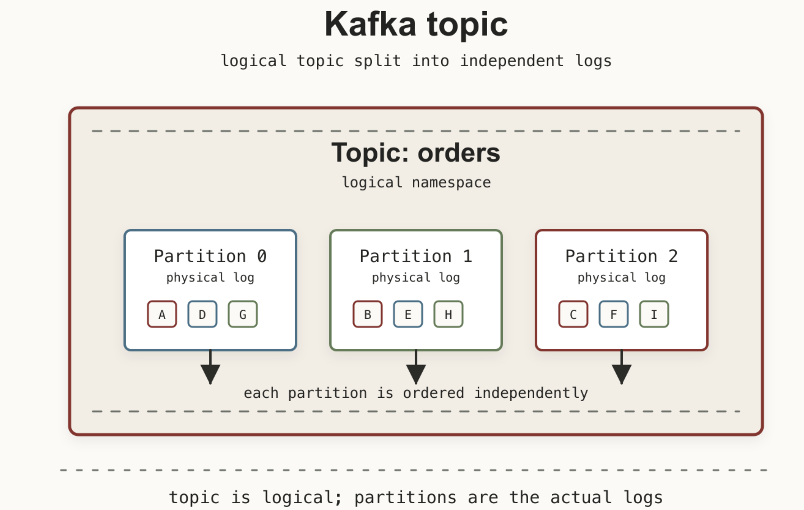
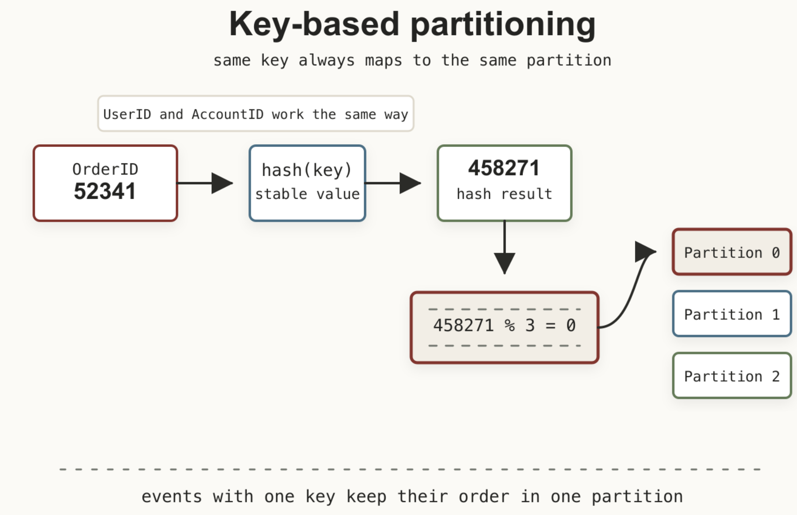
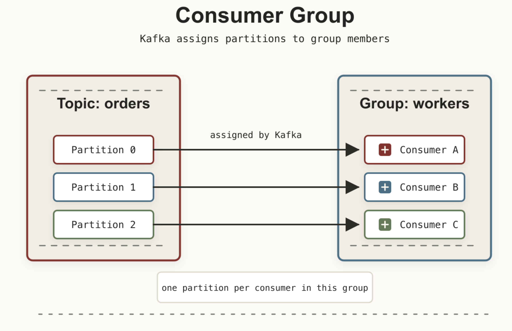
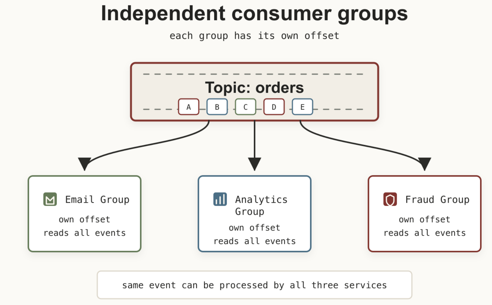

В первой части мы познакомились с основными компонентами Kafka:

- `Broker`
- `Topic`
- `Producer`
- `Consumer`

Но главный вопрос остался открытым – как Kafka способна обрабатывать миллионы сообщений в секунду и при этом не терять порядок данных? Ответ кроется в двух сущностях: **Partitions и Consumer Groups.**

Именно они делают Kafka тем инструментом, которым она является сегодня. Без них Kafka была бы просто очень классной системой логирования.

## Масштабирование и порядок в Kafka

Представим интернет-магазин, где каждую секунду рождаются событияx от создания заказа до его доставки. В начале пути один брокер справляется с этим потоком. Но когда бизнес вырастает до 50 000 заказов в минуту, тысячи одновременных пользователей и десятка микросервисов, один сервер упирается в потолок по CPU, памяти и дисковому вводу-выводу. Вертикальное масштабирование имеет физический предел, поэтому Kafka масштабируется горизонтально – добавлением новых брокеров.



Допустим, мы расширили кластер до трёх брокеров. Возникает неизбежный вопрос: как распределять сообщения между ними? Самый очевидный способ – случайным образом, например, по round‑robin или по хешу без привязки к смыслу данных. Но у этого подхода есть серьёзная цена.

В нашем магазине последовательность всегда должна быть такой:

```text
Заказ создан
   |
   v
Оплата начата
   |
   v
Оплата подтверждена
   |
   v
Отгрузка начата
   |
   v
Заказ доставлен
```

Если каждое из этих событий отправится на разные брокеры, они будут записаны в разные журналы и обработаны с разной скоростью (из‑за сетевых задержек, разной загрузки дисков или просто разного момента записи). Потребитель, читающий все три потока, может увидеть события в перепутанном порядке – например, «доставлен» раньше «оплачен» или «отгрузка» до «создания».

Для складской логистики, финансовых расчётов и уведомлений клиентов это катастрофа: система будет принимать решения на основе неполных или противоречивых данных.

Kafka решает эту дилемму элегантно – с помощью партиций(Partition). Именно они позволяют совместить скорость и порядок: все сообщения с одним OrderID гарантированно попадают в одну партицию, а разные заказы обрабатываются параллельно.

## Что такое Partition

`Topic` в Kafka – это всего лишь логическая сущность. Физически же каждый топик разбит на несколько независимых журналов. Эти журналы и называются партициями.



Каждая партиция – это строго упорядоченный append-only лог. Сообщения добавляются только в конец, а читаются строго в том порядке, в котором были записаны. Все они могут:

- записываться одновременно;
- читаться одновременно;
- храниться на разных серверах.

Из этого вытекает самый важный принцип: Kafka гарантирует порядок сообщений только внутри одной `Partition`. Между разными партициями никакого глобального порядка нет и быть не может – они работают независимо.

## Как Kafka понимает, куда отправить сообщение

На самом деле все очень просто и ответ зависит от того, есть ли ключ сообщения. Если `Key` отсутствует – `Producer` просто распределяет сообщения самостоятельно. Нагрузка получается равномерной, но порядок связанных сообщений теряется.

Cамый же распространённый сценарий когда есть `Key`. В этом случае Kafka вычисляет хэш ключа и уже по хешу сообщение складывается в строго определенный `Partition`. Например, ключем может быть:

- `OrderID = 52341`
- `UserID = 1827`
- `AccountID = 9912`



В нашем примере сообщение всегда попадёт в `Partition 0` оп заказу `54321`. Это означает, что все события одного заказа всегда будут храниться в одной партиции, а значит – сохранят правильный порядок.

**Но что, если партиций станет больше?**

В какой то момент для увеличения производительности и параллелизма вам может понадобиться сделать количество партиций больше.

При увеличении количества `partitions` некоторые ключи могут начать попадать в другие `partitions`. Старые сообщения при этом никуда не перемещаются. Поскольку Kafka гарантирует порядок только внутри одной partition, порядок событий для одного key между старыми и новыми partitions может нарушиться. Поэтому количество partitions желательно планировать заранее.



## Потребители и группы потребителей (Consumer & Consumer Group)

До сих пор мы рассматривали ситуацию, когда топик читает один потребитель (`consumer`). Это работает отлично, пока объём сообщений невелик. 

Но что происходит, когда сообщений становятся миллионы в секунду? Один consumer не справляется с нагрузкой – он становится узким местом. Для масштабирования потребления в Kafka используется механизм групп потребителей (`consumer groups`).

### Что такое Consumer Group?

`Consumer group` – это набор consumer-ов, которые совместно читают один или несколько топиков, распределяя между собой партиции. Каждая партиция топика назначается ровно одному consumer’у внутри группы.



Благодаря этому:

- Параллелизм растёт линейно с числом партиций.
- Порядок сообщений сохраняется внутри каждой партиции (гарантируется только для одного раздела).
- Каждое сообщение обрабатывается только одним consumer’ом в группе – это исключает дублирующую обработку в пределах группы (но не гарантирует однократность при сбоях, об этом ниже).



Если в группе больше consumer-ов, чем партиций, часть из них останутся без работы. Например, для 3 партиций и 5 consumer-ов:

```
text
Partition 0  →  Consumer A
Partition 1  →  Consumer B
Partition 2  →  Consumer C
Consumer D   →  idle
Consumer E   →  idle
```

Kafka никогда не назначает одну партицию двум consumer-ам в одной Consumer Group одновременно. Это частый вопрос на собеседованиях – он проверяет понимание базового принципа работы групп.

### Отказоустойчивость: как работает ребалансировка

Если один из consumer-ов выходит из строя, Kafka обнаруживает это и инициирует ребалансировку – перераспределение партиций между оставшимися consumer-ами.

Пример: consumer B упал. После ребалансировки партиция 1 может быть передана, например, consumer A:

```text
Partition 0  →  Consumer A
Partition 1  →  Consumer A
Partition 2  →  Consumer C
```

Или consumer C, в зависимости от стратегии назначения. В любом случае потребление продолжается автоматически, без вмешательства разработчика (если не считать настройки таймаутов).

Однако важно помнить: во время ребалансировки потребление на время приостанавливается, а при смене владельца партиции возможно повторное чтение сообщений (если смещения ещё не зафиксированы). Поэтому для критичных сценариев рекомендуется использовать идемпотентную обработку или ручное управление смещениями.

Работа продолжается практически автоматически. Именно поэтому `Consumer Group` обеспечивает отказоустойчивость без участия разработчика.

### Как разные сервисы читают один и тот же топик?

Часто новички думают, что если одно сообщение прочитано одним consumer-ом, то другие его уже не увидят. Это не так – в Kafka каждая группа потребителей имеет собственный сдвиг (`offset`) и читает топик независимо.

Предположим, у нас есть топик orders, и три независимых сервиса:

- Email-сервис (отправка писем),
- Аналитический сервис (сбор статистики),
- Сервис обнаружения мошенничества.

Каждый из них создаёт свою группу потребителей:



Каждая группа хранит свой offset, поэтому одно и то же событие может быть обработано всеми тремя сервисами параллельно, без дублирования в рамках одной группы и без необходимости изменять продюсера.

## Что дальше?

Теперь мы понимаем две ключевые идеи Kafka:

- `Partition` отвечает за масштабирование и порядок сообщений.
- `Consumer Group` отвечает за параллельную обработку и отказоустойчивость.

В следующей части заглянем внутрь `Partition`: что такое `Record`, зачем нужен `Offset`, как работает append-only log и почему Kafka спокойно пишет на диск, пока многие системы от одной мысли об этом начинают тяжело дышать.
