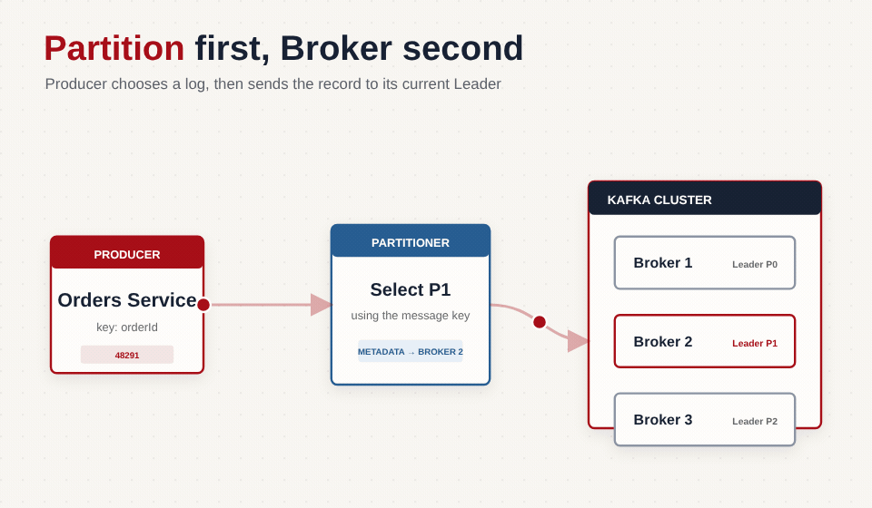
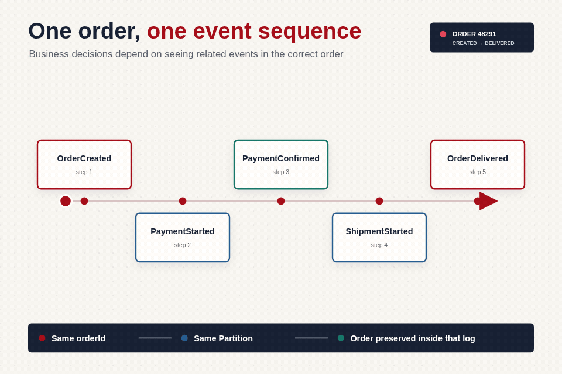
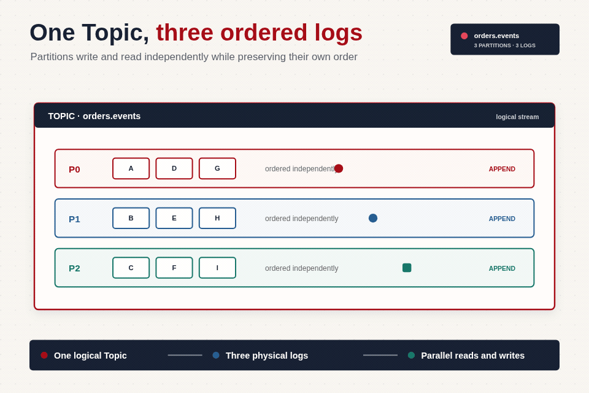
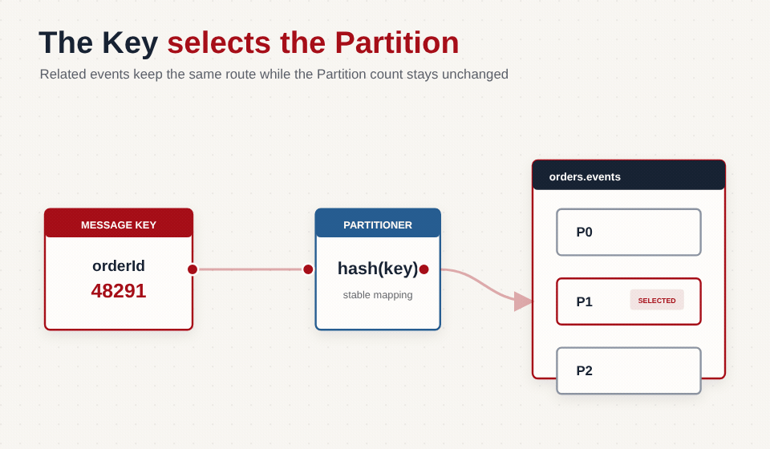
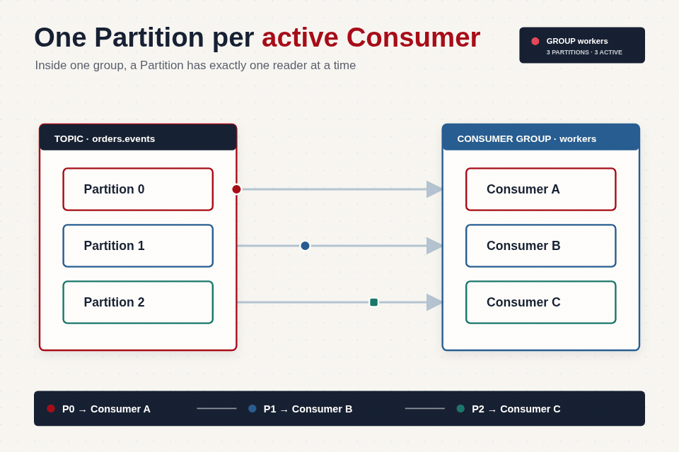
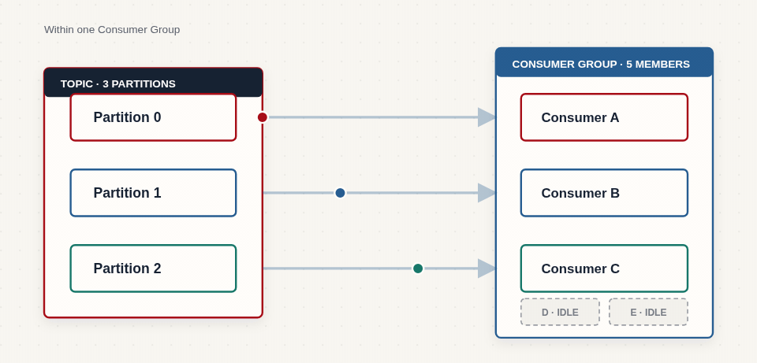
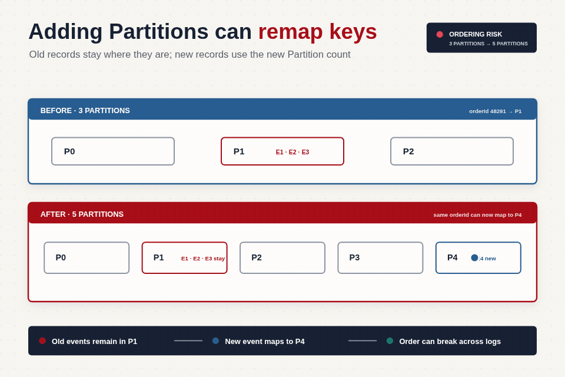
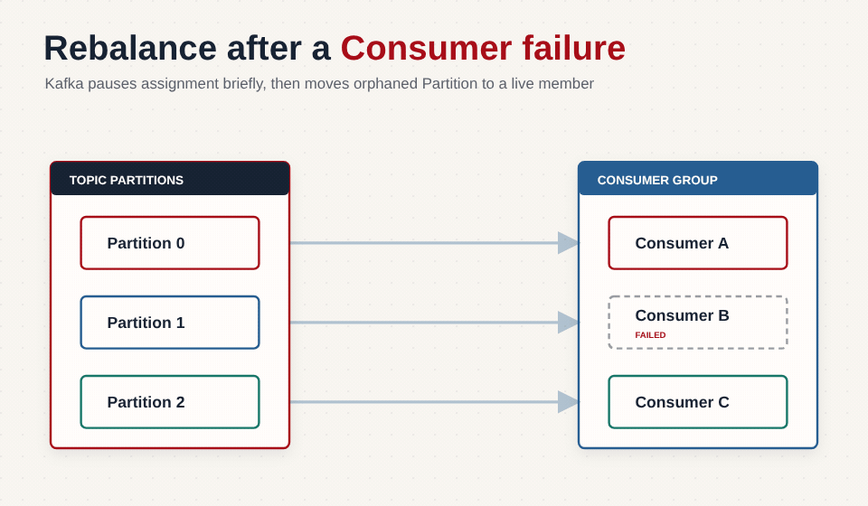
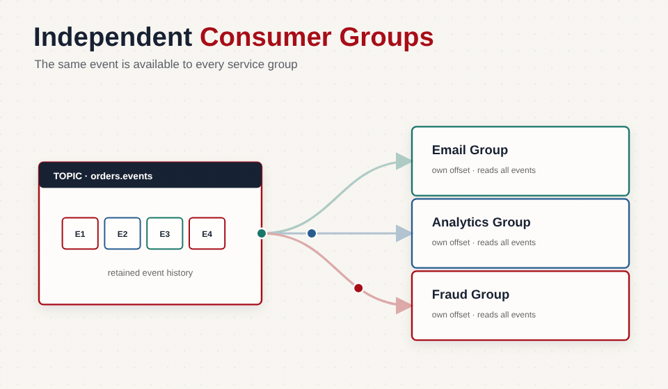

В первой части мы разобрали общую схему: Producer отправляет сообщения в Topic, Broker хранит их, а Consumer читает. Для начала этого достаточно, но пока схема выглядит так, будто весь поток проходит через один журнал и обрабатывается одним приложением.

С ростом магазина этого становится мало. Сообщения нужно распределить между несколькими журналами, а обработку — между несколькими Consumer. При этом события одного заказа должны сохранять правильную последовательность: сначала оплата, потом сборка и доставка.

Эти задачи решают два механизма Kafka. Partition позволяют разделить Topic на независимые журналы, а Consumer Group распределяет их между несколькими Consumer. Давайте разберёмся, как это работает и где при масштабировании можно потерять порядок событий.

## Масштабирование и порядок в Kafka

Начнём с распределения записи. Наш интернет-магазин вырос, и теперь в Kafka поступает 50 000 событий в минуту: заказы создаются, оплачиваются, собираются и передаются в доставку. Один Broker упирается в CPU, память и дисковый ввод-вывод, поэтому кластер приходится масштабировать горизонтально — добавлять Broker.

Допустим, теперь в кластере работают три Broker. Топик состоит из Partition — отдельных журналов сообщений. Их можно распределить между серверами, чтобы использовать ресурсы кластера параллельно. Само добавление Broker не увеличивает число Partition: их количество задаётся отдельно.

Здесь легко перепутать две вещи, поэтому я разделю их явно. При отправке сообщения Producer сначала выбирает Partition. У каждой Partition есть текущий Leader — Broker, который принимает записи в её журнал. Producer узнаёт его из метаданных кластера и отправляет сообщение ему. Подробнее роль лидера разберём далее.

Теперь возникает более важный вопрос: как выбирать Partition и при этом сохранять правильный порядок связанных событий?

В нашем магазине последовательность всегда должна быть такой:

Если события одного заказа попадут в разные Partition, они окажутся в независимых журналах и могут обрабатываться с разной скоростью. Общего порядка между Partition Kafka не гарантирует, поэтому Consumer может увидеть событие «заказ доставлен» раньше события «оплата подтверждена».

Для склада, финансовых расчётов и уведомлений клиентов это проблема: сервисы могут принять решение до того, как получат необходимое событие.

Чтобы совместить порядок и параллельную обработку, Producer использует `orderId` как ключ сообщения. По ключу он выбирает Partition: события одного заказа попадают в один журнал и сохраняют порядок, а события разных заказов могут записываться и обрабатываться параллельно. На каком именно Broker находится выбранная Partition, для этой гарантии неважно.

## Что такое Partition

Topic в Kafka — это всего лишь логическая сущность. Физически же каждый топик разбит на несколько независимых журналов. Эти журналы и называются Partition.

Каждая Partition — это строго упорядоченный append-only лог. Сообщения добавляются только в конец, а читаются строго в том порядке, в котором были записаны. Все они могут:

- записываться одновременно;
- читаться одновременно;
- храниться на разных серверах.

Из этого вытекает самый важный принцип: Kafka гарантирует порядок сообщений только внутри одной Partition. Между разными Partition никакого глобального порядка нет и быть не может — они работают независимо.

## Как Kafka понимает, куда отправить сообщение

Выбор Partition зависит от того, есть ли у сообщения ключ. Если Key отсутствует, Producer распределяет сообщения по своим правилам. Это помогает распределить нагрузку, но не гарантирует, что связанные события попадут в один журнал.



Самый распространённый сценарий — сообщение с Key. При стандартном распределении по ключу Producer вычисляет его хеш и на этой основе выбирает Partition. Затем отправляет запись на Broker, который является текущим Leader этой Partition. Например, ключом может быть:

- `orderId = 48291`
- `userId = 1827`
- `accountId = 9912`

В нашем примере сообщения с ключом `orderId=48291` попадут в одну и ту же Partition. Это означает, что события этого заказа будут храниться вместе и Kafka сохранит порядок их записи.

Подробнее о выборе Partition по ключу — в разделе [Load balancing официальной документации Kafka](https://kafka.apache.org/41/design/design/#load-balancing).

## Consumer и Consumer Group

До сих пор мы рассматривали ситуацию, когда топик читает один Consumer. Это работает отлично, пока объём сообщений невелик.

Но что происходит, когда сообщений становятся миллионы в секунду? Один Consumer не справляется с нагрузкой — он становится узким местом. Для масштабирования потребления в Kafka используется механизм Consumer Group.

### Что такое Consumer Group?

Consumer Group — это набор Consumer, которые совместно читают один или несколько топиков, распределяя между собой Partition. Каждая Partition топика назначается ровно одному Consumer внутри группы.

Благодаря этому:

- Больше Partition позволяет подключить больше Consumer и обрабатывать данные параллельно. Реальный прирост производительности зависит от ресурсов Broker, дисков и сети, распределения ключей и скорости обработки сообщений.
- Порядок сообщений сохраняется внутри каждой Partition (гарантируется только для одного раздела).
- Каждую Partition в группе в конкретный момент читает один Consumer. Это распределяет работу между участниками группы, но не исключает повторную обработку после сбоев.



Если в группе больше Consumer, чем Partition, часть из них останутся без работы. Например, для 3 Partition и 5 Consumer:

Kafka никогда не назначает одну Partition двум Consumer в одной Consumer Group одновременно. Это частый вопрос на собеседованиях — он проверяет понимание базового принципа работы групп.

### Когда нужно увеличивать количество Partition

Теперь становится понятно, зачем вообще может понадобиться больше Partition. Представим, что во время распродажи все три Consumer из примера загружены полностью, а необработанные события продолжают накапливаться. Мы запускаем ещё два Consumer, но они остаются без работы: в топике по-прежнему только три Partition.

Чтобы группа могла обрабатывать поток в пять параллельных задач, топику потребуется как минимум пять Partition. Дополнительные Partition также позволяют распределить запись между большим числом Broker. Конечно, это поможет только в том случае, если сами Broker, сеть, база данных и внешние сервисы выдержат возросшую нагрузку.

Однако увеличение числа Partition меняет распределение сообщений по ключам. Допустим, при трёх Partition события заказа `48291` попадали в Partition 1. После увеличения их количества следующее событие того же заказа может попасть уже в Partition 4.

Старые записи останутся в Partition 1: Kafka не переносит их автоматически. В результате разные Consumer смогут одновременно читать старую и новую Partition. Новое событие заказа может быть обработано раньше старого, хотя внутри каждой отдельной Partition порядок по-прежнему сохраняется.

Поэтому количество Partition лучше планировать с запасом. Если строгий порядок событий по ключу обязателен, увеличение их числа требует отдельного плана перехода: например, остановить запись и дождаться обработки накопившихся сообщений или перенести поток в новый топик.



### Отказоустойчивость: как работает ребалансировка

Если один из Consumer выходит из строя, Kafka обнаруживает это и инициирует ребалансировку — перераспределение Partition между оставшимися Consumer.

Пример: Consumer B упал. После ребалансировки Partition 1 может быть передана, например, Consumer A:

Или Consumer C, в зависимости от стратегии назначения. В любом случае потребление продолжается автоматически, без вмешательства разработчика (если не считать настройки таймаутов).

При перераспределении Partition возможна пауза в обработке, а после смены Consumer некоторые сообщения могут быть прочитаны повторно. В следующих частях разберём, как Kafka запоминает позицию чтения и как приложение сохраняет её и защищается от повторной обработки.

Таким образом, Consumer Group автоматически перераспределяет работу после отказа участника. Корректную обработку сообщений после такого переключения должно обеспечить само приложение.

### Как разные сервисы читают один и тот же топик?

Часто новички думают, что если одно сообщение прочитано одним Consumer, то другие его уже не увидят. В Kafka каждая Consumer Group сохраняет собственную позицию чтения для каждой Partition и читает топик независимо. Подробнее этот кейс разберём далее...

Топик `orders.events` нашего магазина читают три независимых сервиса:

- Email-сервис (отправка писем),
- Аналитический сервис (сбор статистики),
- Сервис обнаружения мошенничества.

Каждый из них создаёт свою Consumer Group:

Позиции чтения групп независимы, поэтому одно и то же событие доступно всем трём сервисам. Внутри каждой группы Partition распределяются между её участниками. Чтобы подключить новый сервис, достаточно создать для него отдельную группу: менять Producer для этого не нужно.

## Что дальше?

Теперь мы понимаем две ключевые идеи Kafka:

- Partition отвечает за масштабирование и порядок сообщений.
- Consumer Group отвечает за параллельную обработку и отказоустойчивость.

Теперь предлагаю заглянуть внутрь одной Partition. Что именно мы записали, как найти нужное сообщение и откуда Consumer продолжит чтение после перезапуска? Далее разберём Record, Offset и запись журнала на диск.
