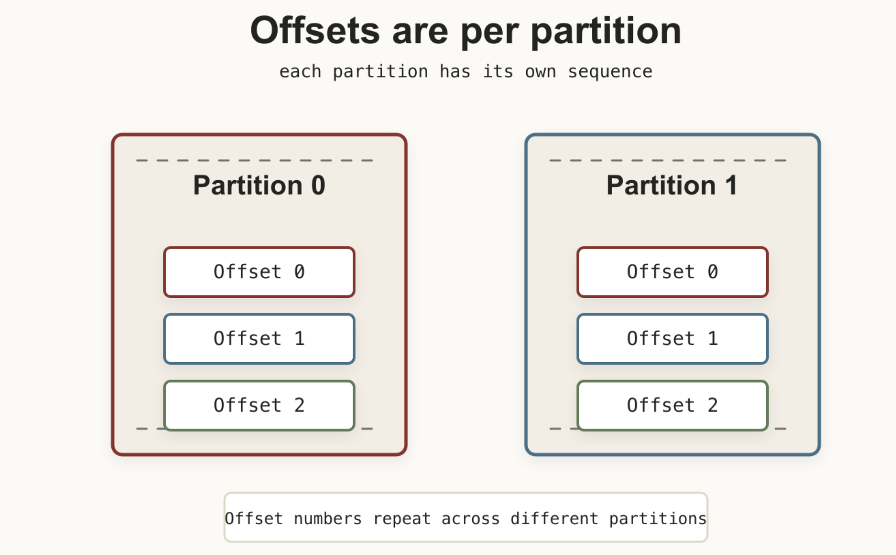
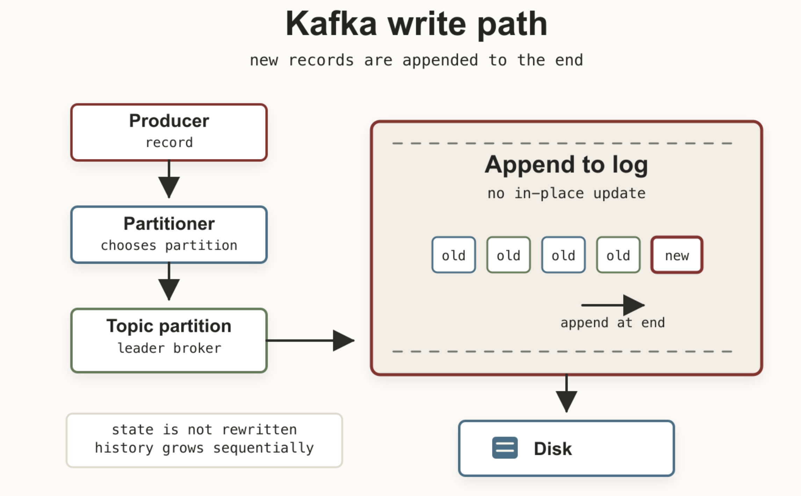

В предыдущей части мы разобрались с `Partition` и `Consumer Group`.

Теперь посмотрим, что Kafka физически хранит внутри.

Иногда Kafka представляют как большую очередь сообщений, которая живёт где-то в памяти. На практике всё гораздо прозаичнее: в основе Kafka лежит обычный журнал на диске.

## Partition — это лог

Каждая `Partition` — упорядоченная последовательность записей:

```text
Partition 0

Offset 0  User Registered
Offset 1  Order Created
Offset 2  Payment Success
Offset 3  Email Sent
Offset 4  Delivery Started
```

Новые записи добавляются в конец. Kafka не нужно вставлять данные в середину журнала или постоянно перемещать уже записанные данные.

Отсюда и термин `append-only log`.

Это одна из причин высокой производительности Kafka: последовательная запись на диск хорошо ложится на то, как работают современные накопители и файловая система.

## Что представляет собой сообщение

Сообщение в Kafka называется `Record`. Упрощённо его можно представить так:

```text
+-----------------------+
| Key                   |
| Value                 |
| Timestamp             |
| Headers               |
+-----------------------+
```

`Value` — полезная нагрузка сообщения. JSON, Avro, Protobuf, строка или произвольные бинарные данные — для Kafka это просто байты.

Например:

```json
{
  "orderId": 1523,
  "status": "paid",
  "price": 4999
}
```

Как мы уже говорили ранее – `Key` часто используется при выборе партиции. Например, ключом может быть `UserID` или `OrderID`.

При стандартном `key-based partitioning` одинаковый ключ будет направляться в одну и ту же партицию, пока количество партиций не меняется. Поэтому события одного объекта можно обрабатывать в правильном порядке.

`Timestamp` хранит время события или его добавления в Kafka — в зависимости от конфигурации.

`Headers` позволяют передавать дополнительные метаданные: например, `TraceID`, `Content-Type` или `RequestID`.

## Offset

После попадания в партицию запись получает `Offset` — её позицию внутри журнала. Offset не является глобальным ID сообщения. Он уникален только в пределах конкретной партиции. 





Для `Consumer Group` Kafka хранит committed offset. Consumer после перезапуска может продолжить чтение с той же позиции, на которой остановился. При этом сами записи остаются в Kafka столько, сколько позволяют настройки `retention`. А значит, историю можно прочитать повторно. Это удобно, когда нужно заново построить аналитику, переиндексировать данные или повторно обработать события после изменения логики приложения.

## Что происходит при записи

Если сильно упростить путь сообщения — `Producer` отправляет `record`. `Partitioner` выбирает партицию, запрос попадает на `broker`, который является её `leader`, а запись добавляется в лог.



Kafka не нужно искать старую запись и изменять её на месте. Основной сценарий — дописать новые данные в конец. И получается вместо постоянного изменения состояния мы получаем последовательную историю событий.

`Offset` естественным образом отвечает на вопросы:

- Что было раньше?
- Что читать следующим?
- До какого места дошёл consumer?
- Откуда начать повторное чтение?

Поэтому в Kafka основной адрес записи выглядит примерно так:

```text
Topic + Partition + Offset
```

Например:

```text
orders / partition 2 / offset 58213
```

Но пока здесь есть очевидная проблема. Если вся партиция физически находится на одном broker, что произойдёт, когда этот broker упадёт? Для этого в Kafka существует репликация.

В следующей части разберём `Leader`, `Follower`, `ISR` и посмотрим, как Kafka переживает потерю broker.
