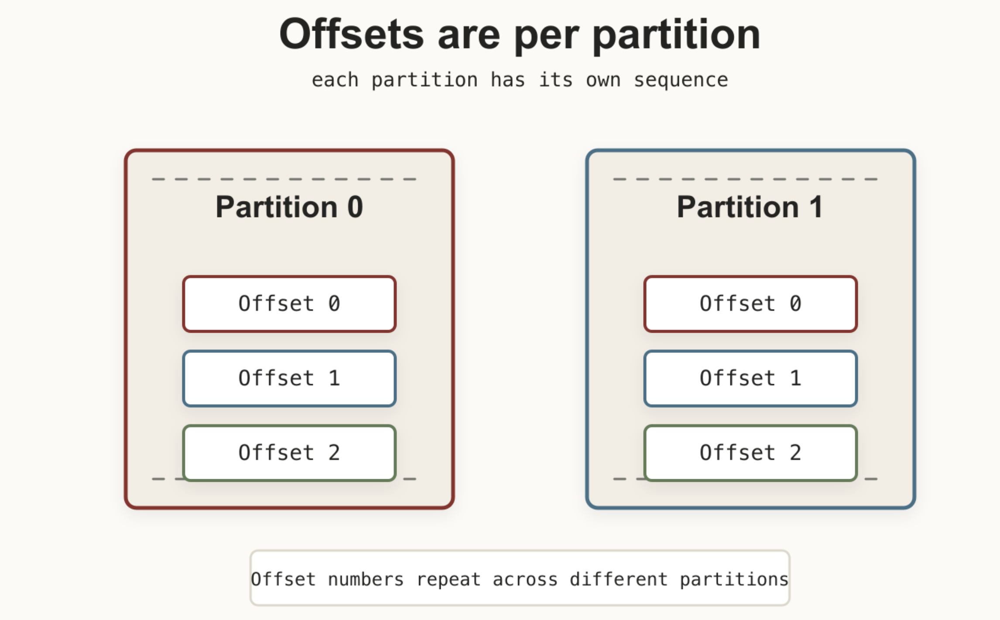
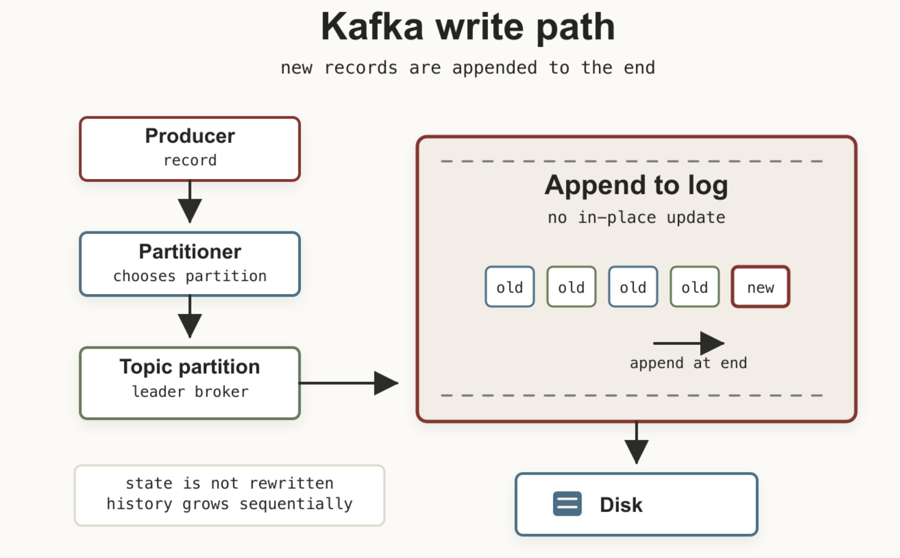

В предыдущей части наш интернет-магазин вырос, и мы распределили события заказов между Partition, используя `orderId` как ключ. Теперь предлагаю немного приблизить картинку: выберем одну Partition и посмотрим, что Kafka физически хранит внутри неё.

Иногда Kafka представляют как большую очередь сообщений, которая живёт где-то в памяти. На практике всё гораздо прозаичнее: в основе Kafka лежит обычный журнал на диске.

## Partition — это "просто" лог

Каждая Partition — упорядоченная последовательность записей:

```text
Partition 0

Offset 0  OrderCreated      orderId=48291
Offset 1  PaymentCompleted  orderId=48291
Offset 2  DeliveryStarted   orderId=48291
Offset 3  OrderDelivered    orderId=48291
```

Такой журнал называют append-only log: новые записи добавляются только в конец. Kafka не приходится искать место для вставки или сдвигать уже записанные данные.

Последовательная запись крупных блоков помогает эффективно использовать накопители и файловый кэш ОС. К механизмам производительности вернёмся далее. Пока я предлагаю запомнить одну мысль: новое сообщение продолжает историю, а не переписывает предыдущие записи.

## Из чего состоит Record

В примере выше каждая строка выглядит как название события и номер заказа. Но Kafka хранит не просто строку `PaymentCompleted`. Каждое сообщение представляет собой Record, в котором есть сами данные и служебная информация.

Чтобы понять устройство Record, продолжим следить за оплатой заказа `48291`. Получателю нужно узнать, что произошло, к какому заказу относится событие, когда оно было создано и есть ли у него дополнительные метаданные. За эти сведения отвечают Value, Key, Timestamp и Headers:

```text
+-----------------------+
| Key                   |
| Value                 |
| Timestamp             |
| Headers               |
+-----------------------+
```

Начнём с Value — полезной нагрузки сообщения. Именно здесь находятся данные, ради которых событие публикуется. Это может быть JSON, Avro, Protobuf, строка или произвольный набор байтов: Kafka не пытается самостоятельно понять их смысл.

Для начала покажем только бизнес-данные об оплате заказа. Это упрощённый пример Value: далее добавим сведения, которые помогут получателям различать события и безопасно обрабатывать их.

```json
{
  "orderId": 48291,
  "status": "paid",
  "price": 4999
}
```

Value отвечает на вопрос «что произошло?», а Key помогает Kafka решить, в какой журнал поместить запись. В нашем магазине таким ключом служит `orderId`, например `48291`.

При стандартном key-based partitioning одинаковый ключ будет направляться в одну и ту же Partition, пока количество Partition не меняется. Поэтому события одного объекта можно обрабатывать в правильном порядке.

Итак, Value содержит событие, а Key связывает его с нужной Partition. Следующий вопрос — какое время хранится вместе с записью? За него отвечает Timestamp. Смысл этой метки зависит от настройки топика `message.timestamp.type`:

- `CreateTime` — время, которое задаёт Producer. Приложение может явно указать момент события, например время оформления заказа. Если время не указано, Producer подставляет время создания записи.
- `LogAppendTime` — время добавления записи в журнал Kafka. Его устанавливает Broker, заменяя временную метку, присланную Producer.

Например, заказ оформлен в 12:00, а запись о нём попала в Kafka в 12:05. При `CreateTime` она может сохранить метку 12:00, если приложение передало время заказа. При `LogAppendTime` метка будет 12:05. Поэтому Timestamp нельзя автоматически считать временем самого события: нужно знать конфигурацию топика и то, как Producer заполняет это поле.

Наконец, Headers позволяют добавить служебные метаданные, не смешивая их с бизнес-данными в Value. Например, здесь можно передать `TraceID`, `Content-Type` или `RequestID`.

Теперь мы знаем содержимое записи и понимаем, как Key связывает её с Partition. Осталось определить место записи внутри выбранного журнала.

## Offset

После добавления в Partition запись получает Offset — свою позицию внутри журнала. Если Key помогает выбрать Partition, то Offset позволяет найти запись уже внутри неё. Это не глобальный ID сообщения: одинаковые значения Offset существуют в разных Partition.

Здесь проявляется важное отличие Kafka от традиционной очереди: чтение сообщения не удаляет его из журнала. Kafka хранит записи согласно политике хранения, поэтому их можно прочитать повторно, а разные приложения могут независимо обрабатывать один и тот же поток событий.



Consumer может сохранить позицию, с которой его группа продолжит чтение после перезапуска. Её называют `committed offset`. Для каждой Partition позиция сохраняется отдельно: например, после обработки записи с offset `100` группа сохраняет `101` — offset следующей записи. После сбоя чтение возобновляется с сохранённой позиции, поэтому записи, обработанные после последнего сохранения, могут прийти повторно.



Различие между текущей позицией чтения и сохранённой позицией подробнее описано в разделе [Consumer Position](https://kafka.apache.org/41/design/design/#consumer-position).

Возврат к более раннему offset и повторное чтение доступной истории называют Replay. Например, аналитика магазина может заново обработать события заказов после исправления ошибки в расчётах. Само повторное чтение не отменяет уже выполненные действия: если Consumer отправляет письма или начисляет бонусы, приложение должно учитывать последствия повторов.

Replay возможен только пока нужные записи остаются в Kafka. Политику хранения называют retention. В следующих частях подробно разберём её настройки и рассмотрим, когда сохранять committed offset, чтобы учитывать сбои и повторную обработку.

## Собираем путь записи целиком

Мы отдельно разобрали Record, Partition и Offset. Теперь соберём их в одну последовательность.

Producer подготавливает Record с Key, Value, Timestamp и Headers. Partitioner использует Key, чтобы выбрать Partition. Затем Producer отправляет запрос на Broker, где находится Leader этой Partition. Leader добавляет запись в конец журнала, и она получает Offset.



Kafka не нужно искать старую запись и изменять её на месте. Основной сценарий — дописать новые данные в конец. Вместо постоянного изменения состояния получается последовательная история событий.

Offset естественным образом отвечает на вопросы:

- Что было раньше?
- Что читать следующим?
- До какого места дошёл Consumer?
- Откуда начать повторное чтение?

В результате Topic указывает на поток, Partition — на конкретный журнал внутри него, а Offset — на позицию записи. Поэтому её адрес выглядит примерно так:

```text
Topic + Partition + Offset
```

Например:

```text
orders.events / partition 2 / offset 58213
```

Но пока здесь есть очевидная проблема. Если вся Partition физически находится на одном Broker, что произойдёт, когда этот Broker упадёт? Для этого в Kafka существует репликация.

Далее разберём Leader, Follower, ISR и посмотрим, как Kafka переживает потерю Broker.
