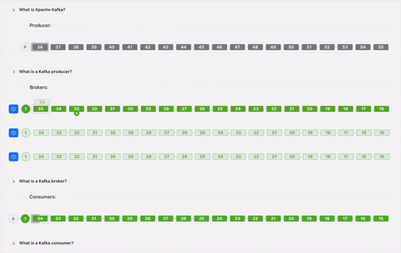
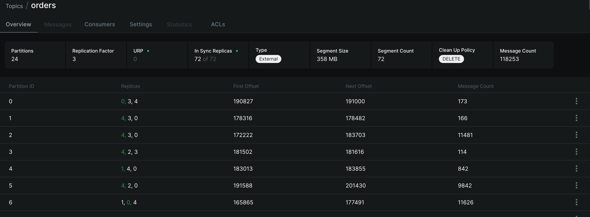
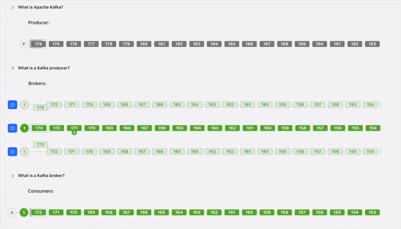

До этого момента мы рассматривали Kafka так, будто каждая `Partition` хранится только на одном сервере. Для объяснения это удобно, но в production такой подход слишком рискованный.

Возникает простой вопрос: что будет, если этот сервер выйдет из строя? Если данные существуют в единственном экземпляре, вместе с сервером можно потерять и сообщения. Поэтому в Kafka каждая `Partition` обычно хранится сразу на нескольких `Broker`.

## Репликация

Представим кластер из трёх `Broker` и `Topic` orders, состоящий из одной `Partition`. Вместо хранения данных только на одном сервере Kafka создаёт несколько копий. Их количество задаётся параметром `replication.factor`. Посмотрим, как распределятся данные в кластере с `replication.factor=3`.

Несмотря на несколько копий, продюсеры не пишут во все реплики сразу. Для каждой `Partition` Kafka выбирает один `Leader`.

`Leader` принимает:

- все записи;
- все операции чтения по умолчанию;
- подтверждения клиентов.

`Producer` работает только с `Leader` и не пишет напрямую в `Followers`. Остальные копии становятся `Follower`. Они не принимают записи напрямую, а постоянно копируют изменения с `Leader`.

Последовательность отправки сообщения выглядит так:

- `Producer` отправляет сообщение `Leader`;
- `Leader` записывает его в свой лог;
- `Followers` копируют запись;
- `Producer` получает подтверждение в зависимости от настройки `acks`.

## Переключение Leader при сбое и ISR

Представим, что в какой-то момент broker с лидером партиции становится недоступен. Кластер должен выбрать нового лидера. В Kafka этим занимается `Controller` — специальная роль внутри кластера, которая следит за состоянием `Broker`, `Topic` и `Partition`.

В современных версиях Kafka управление метаданными работает через KRaft-кворум контроллеров, без ZooKeeper. Для базового понимания важно следующее: при аварии `Controller` выбирает нового лидера из `ISR` (`In-Sync Replicas`).

На практике можно встретить ситуацию, когда деградировала сеть и одна из реплик начинает отставать. Это означает, что данные с лидера попадают на неё с задержкой. Kafka не должна назначать лидером такую устаревшую копию. `ISR` как раз хранит список актуальных реплик, которые не отстают критично и готовы взять на себя роль лидера.

В качестве примера просто возьмем скриншот из kafka-ui. Здесь как раз видно, что данный топик разбит на 24 партиции с фактором репликации 3. Ну и поскольку данный кластер жив и здоров, то количество реплик 72 из 72 = 24 * 3.

Но нас всё-таки интересует вопрос, что будет при сбое `Leader`. `Producer` получит ошибку или увидит, что старый `Leader` недоступен. Затем он обновит метаданные кластера и начинает писать в новый `Leader`. Обычно это занимает доли секунды. При корректных настройках приложение продолжает работу после короткой паузы.

Когда старый сервер возвращается в кластер, он не становится `Leader` автоматически. Сначала Kafka догоняет его журнал. После синхронизации он становится обычным `Follower`. Так Kafka не позволяет устаревшей копии начать обслуживать клиентов.

## Что такое acks

При записи `Producer` выбирает, сколько подтверждений нужно дождаться от Kafka. За это отвечает параметр `acks`.

`acks=0` — Подтверждение не нужно. `Producer` отправляет сообщение и сразу продолжает работу.  Это дает максимальную скорость, но и минимальная надёжность. Если `Broker` не успеет записать сообщение, `Producer` об этом не узнает.

`acks=1` — `Producer` ждёт подтверждение только от `Leader`. `Followers` в этот момент могут ещё не получить данные. Если `Leader` выйдет из строя до репликации, последние сообщения могут потеряться.

`acks=all` — `Producer` ждёт подтверждение от всех реплик, которые должны подтвердить запись согласно текущему `ISR` и настройке `min.insync.replicas`. Только после этого запись считается завершённой. Даже если `Leader` сразу выйдет из строя, данные уже есть на других `Broker`. Это самый надёжный режим, но вы платите за это временем.

Критичная production-связка обычно выглядит так: `replication.factor=3`, `min.insync.replicas=2`, `acks=all`. В этом случае Kafka требует минимум две актуальные реплики для успешной записи. Если одна из трёх реплик недоступна, запись ещё может продолжаться. Если в `ISR` остаётся только одна реплика, Kafka вернёт ошибку вместо того, чтобы подтвердить потенциально рискованную запись.

## Можно ли потерять сообщения?

Да, если настройки позволяют подтвердить запись до репликации.

Например:

- используется `acks=1`;
- `Leader` подтвердил запись;
- `Followers` ещё не успели получить данные;
- `Leader` сразу вышел из строя.

В таком сценарии последние сообщения могут исчезнуть.

Для критичных систем обычно используют:

- `acks=all`;
- достаточный `replication.factor`;
- настройки `min.insync.replicas`, запрещающие подтверждать запись, если в `ISR` осталось слишком мало реплик.

## Почему Kafka выдерживает отказы

Теперь видно, за счёт чего Kafka переживает отказы.

Каждая `Partition`:

- хранится на нескольких `Broker`;
- имеет только одного `Leader`;
- автоматически переключается на резервную реплику;
- использует `ISR` для защиты от выбора устаревших данных.

Благодаря этому отказ одного или нескольких серверов обычно не останавливает всю систему.

## Что дальше?

Теперь мы понимаем, как Kafka хранит данные и защищает их от потери.

Но остаётся ещё один вопрос: почему Kafka способна обрабатывать большие потоки сообщений без резкого проседания производительности?

В следующей части разберём, откуда берётся скорость: последовательная запись на диск, Page Cache, пакетная передача данных (`Batching`), Zero Copy и другие инженерные решения.
