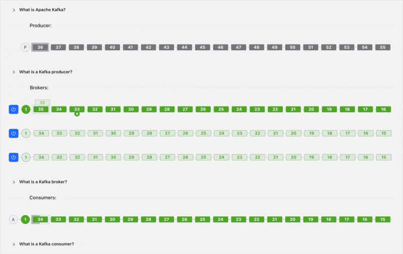
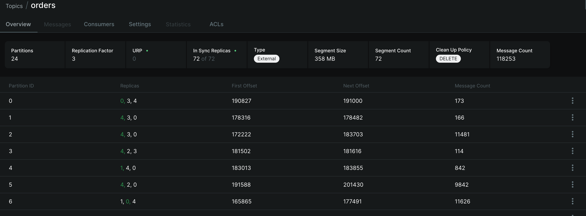
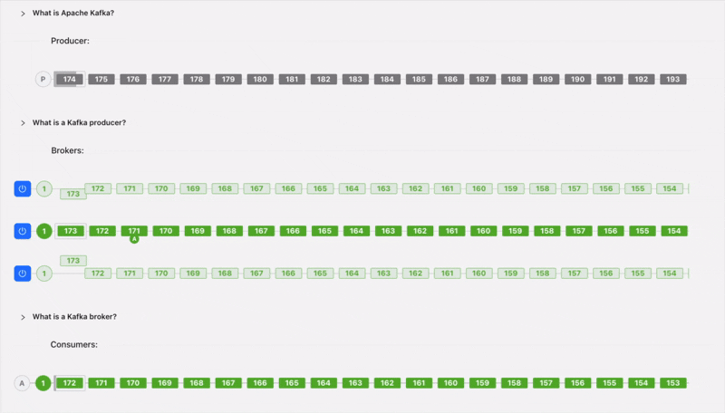

До этого момента мы рассматривали Kafka так, будто каждая `Partition` хранится только на одном сервере. Для объяснения это удобно, но в production такой подход слишком рискованный.

Возникает простой вопрос: что будет, если этот сервер выйдет из строя? Если данные существуют в единственном экземпляре, вместе с сервером можно потерять и сообщения. Поэтому в Kafka каждая `Partition` обычно хранится сразу на нескольких `Broker`.

## Репликация

Представим кластер из трёх `Broker` и `Topic` orders, состоящий из одной `Partition`. Вместо хранения данных только на одном сервере Kafka создаёт несколько копий. Их количество задаётся параметром `replication.factor`. 

Давайте для наглядности посмотрим, как распределятся данные в кластере с `replication.factor=3`. На экране изображен один лидер и два фоловера. Как мы можем видеть - продюсеры не пишут во все реплики сразу.

У каждой партиции есть несколько копий на разных брокерах. Одну из них Kafka назначает основной — её называют лидером (`Leader`). `Producer` отправляет новые сообщения брокеру, который хранит эту копию. Остальные копии называют репликами-последователями (`Followers`): они получают новые записи от лидера и сохраняют их у себя. Если брокер с лидером выйдет из строя, Kafka сможет выбрать нового лидера из подходящих реплик.

Давайте запомним, что `Leader` отвечает:

- за всю запись;
- все операции чтения по умолчанию;
- подтверждения консьюмеров.

А последовательность отправки сообщения выглядит так:

- `Producer` отправляет сообщение `Leader`;
- `Leader` записывает его в свой лог;
- `Followers` копируют запись;
- `Producer` получает подтверждение в зависимости от настройки `acks`.

## Переключение Leader при сбое и ISR

Представим, что в какой-то момент broker с лидером партиции становится недоступен. Кластер должен выбрать нового лидера. В Kafka этим занимается `Controller` — специальная роль внутри кластера, которая следит за состоянием `Broker`, `Topic` и `Partition`.



Kafka отслеживает, какие реплики успевают за лидером, и поддерживает набор `ISR` (In-Sync Replicas) — реплик, которые остаются достаточно синхронизированными с ним.

На практике можно встретить ситуацию, когда деградировала сеть и одна из реплик начинает отставать. Это означает, что данные с лидера попадают на неё с задержкой. В этом случае Kafka исключает её из `ISR`. Когда она наверстает отставание, её можно вернуть в набор.

В качестве примера просто возьмем скриншот из kafka-ui. Здесь как раз видно, что данный топик разбит на 24 партиции с фактором репликации 3. Ну и поскольку данный кластер жив и здоров, то количество реплик 72 из 72 = 24 * 3.

Но нас всё-таки интересует вопрос, что будет при сбое `Leader`. А тут всё очень просто - `Producer` получит ошибку или увидит, что старый `Leader` недоступен. Затем он обновит метаданные кластера и начинает писать в новый `Leader`. Обычно это занимает доли секунды. При корректных настройках приложение продолжает работу после короткой паузы.

Когда старый сервер возвращается в кластер, он не становится `Leader` автоматически. Сначала Kafka догоняет его журнал. После синхронизации он становится обычным `Follower`. Так Kafka не позволяет устаревшей копии начать обслуживать клиентов.

## Что такое acks

При записи `Producer` выбирает, сколько подтверждений нужно дождаться от Kafka. За это отвечает параметр `acks`. Именно он  определяет, какого подтверждения записи producer ждёт от Kafka. Он влияет на надёжность сохранения сообщения, но не гарантирует его обработку приложением-получателем. 

`acks=0` — Подтверждение не нужно. `Producer` отправляет сообщение и сразу продолжает работу.  Это дает максимальную скорость, но и минимальная надёжность. Если `Broker` не успеет записать сообщение, `Producer` об этом не узнает. Пример: телеметрия, где допустимы пропуски. Приложение отправляет в Kafka частые замеры температуры с тысяч датчиков. Если несколько замеров потеряются, то ничего страшного не произойдет. 

`acks=1` — `Producer` ждёт подтверждение только от `Leader`. `Followers` в этот момент могут ещё не получить данные. Если `Leader` выйдет из строя до репликации, последние сообщения могут потеряться. Пример: Интернет-магазин сохраняет заказ в базе и отправляет в Kafka событие OrderCreated. Лидер записывает событие и подтверждает успех, но выходит из строя до того, как followers успели его скопировать. Новый лидер этого события не содержит. Заказ существует в базе, а сервис уведомлений так и не узнаёт о нём: покупателю не приходит письмо. Для producer отправка при этом уже считалась успешной.

`acks=all` — `Producer` ждёт подтверждение от всех реплик, которые должны подтвердить запись согласно текущему `ISR` и настройке `min.insync.replicas`. Только после этого запись считается завершённой. Даже если `Leader` сразу выйдет из строя, данные уже есть на других `Broker`. Это самый надёжный режим, но вы платите за это временем. Пример: событие об оплате заказа. После оплаты событие должно запустить сборку заказа на складе. Его потеря означает, что покупатель заплатил, а заказ остался без движения. При `replication.factor=3` и `min.insync.replicas=2` Kafka подтверждает запись после её репликации в текущем `ISR`, где должно оставаться минимум две реплики. Если это условие не выполнено, приложение сохраняет событие для повторной отправки, например через outbox: задержка обработки приемлемее потери оплаченного заказа.

Теперь видно, за счёт чего Kafka переживает отказы и как мы можем на это влиять. 

## Что дальше?

Теперь мы понимаем, как Kafka хранит данные и защищает их от потери. Но остаётся ещё один вопрос: почему Kafka способна обрабатывать большие потоки сообщений без резкого проседания производительности?

В следующей части разберём, откуда берётся скорость: последовательная запись на диск, Page Cache, пакетная передача данных (`Batching`), Zero Copy и другие инженерные решения.
