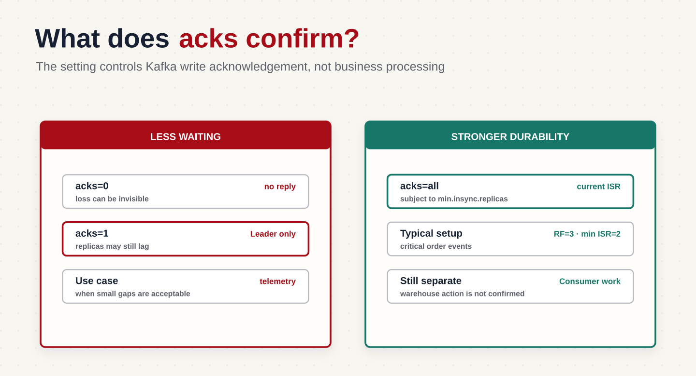

В предыдущей части мы заглянули внутрь Partition `orders.events` и увидели журнал событий заказа. Пока мы рассматривали его так, будто он хранится только на одном сервере. Для объяснения это удобно, но в production такой подход слишком рискованный.

Давайте теперь мысленно выключим этот сервер. Что станет с событиями нашего заказа? Если данные существуют в единственном экземпляре, вместе с сервером можно потерять и сообщения. Поэтому в Kafka каждая Partition обычно хранится сразу на нескольких Broker.

## Репликация

Продолжим тот же пример: кластер состоит из трёх Broker, а события заказа `48291` находятся в одной из Partition топика `orders.events`. Вместо хранения этой Partition только на одном сервере Kafka создаёт несколько копий. Их количество задаётся параметром `replication.factor`.

Посмотрим на кластер с `replication.factor=3`: у Partition есть Leader и два Followers. Producer отправляет записи лидеру, а остальные реплики получают данные от него.

У каждой Partition есть несколько копий на разных Broker. Одну из них Kafka назначает основной — её называют лидером (Leader). Producer отправляет новые сообщения на Broker, который хранит эту копию. Остальные копии называют репликами-последователями (Followers): они получают новые записи от лидера и сохраняют их у себя. Если Broker с лидером выйдет из строя, Kafka сможет выбрать нового лидера из подходящих реплик.

Лидер обслуживает запросы записи и, по умолчанию, чтения для своей Partition. То, когда Producer получит подтверждение записи, зависит от настройки `acks`.

Consumer отдельно сохраняет позицию чтения — фиксирует offset. Это позволяет группе продолжить чтение после перезапуска. Фиксация offset не означает, что лидер проверил успешность бизнес-операции, например отправку письма или резервирование товара.

А последовательность отправки сообщения выглядит так:

- Producer отправляет сообщение Leader;
- Leader записывает его в свой лог;
- Followers копируют запись;
- Producer получает подтверждение в зависимости от настройки `acks`.

## Переключение Leader при сбое и ISR

Представим, что в какой-то момент Broker с лидером Partition становится недоступен. Кластер должен выбрать нового лидера. В Kafka этим занимается Controller — специальная роль внутри кластера, которая следит за состоянием Broker, топиков и Partition.



Kafka отслеживает, какие реплики успевают за лидером, и поддерживает набор ISR (In-Sync Replicas) — реплик, которые остаются достаточно синхронизированными с ним.

На практике можно встретить ситуацию, когда деградировала сеть и одна из реплик начинает отставать. Это означает, что данные с лидера попадают на неё с задержкой. В этом случае Kafka исключает её из ISR. Когда она наверстает отставание, её можно вернуть в набор.

Устройство репликации и роль ISR подробнее разобраны в разделе [Replication официальной документации Kafka](https://kafka.apache.org/41/design/design/#replication).

В качестве примера просто возьмем скриншот из kafka-ui. Здесь как раз видно, что данный топик разбит на 24 Partition с фактором репликации 3. Ну и поскольку данный кластер жив и здоров, то количество реплик 72 из 72 = 24 * 3.

При сбое Leader Producer может получить ошибку или не дождаться ответа. Он обновляет метаданные кластера и после выбора нового лидера направляет запросы на соответствующий Broker. Переключение занимает некоторое время: длительность паузы зависит от обнаружения сбоя и настроек повторных попыток.

Когда старый сервер возвращается в кластер, он не становится Leader автоматически. Сначала Kafka догоняет его журнал. После синхронизации он становится обычным Follower. Так Kafka не позволяет устаревшей копии начать обслуживать клиентов.

## Что такое acks

Мы создали копии данных, но Producer ещё нужно понять, когда считать запись успешной. За это отвечает параметр `acks`: он определяет, какого подтверждения записи Producer ждёт от Kafka. Здесь я прошу не смешивать два результата: «Kafka сохранила событие» и «склад обработал заказ». `acks` влияет на первый, но не гарантирует второй.

`acks=0` — подтверждение не нужно. Producer отправляет сообщение и продолжает работу, не дожидаясь ответа о записи. Это уменьшает ожидание ответа, но повышает риск незаметной потери сообщения. Если Broker не успеет его записать, Producer об этом не узнает. Пример: телеметрия, где допустимы пропуски. Приложение отправляет частые замеры температуры с тысяч датчиков, а потеря нескольких замеров не влияет на результат наблюдения.

`acks=1` — Producer ждёт подтверждение только от Leader. Followers в этот момент могут ещё не получить данные. Если Leader выйдет из строя до репликации, последние сообщения могут потеряться. Пример: Интернет-магазин сохраняет заказ в базе и отправляет в Kafka событие OrderCreated. Лидер записывает событие и подтверждает успех, но выходит из строя до того, как followers успели его скопировать. Новый лидер этого события не содержит. Заказ существует в базе, а сервис уведомлений так и не узнаёт о нём: покупателю не приходит письмо. Для Producer отправка при этом уже считалась успешной.

`acks=all` — Producer ждёт подтверждение от всех реплик, которые должны подтвердить запись согласно текущему ISR и настройке `min.insync.replicas`. Только после этого запись считается завершённой. Даже если Leader сразу выйдет из строя, данные уже есть на других Broker. Это самый надёжный режим, но вы платите за это временем. Пример: событие об оплате заказа. После оплаты событие должно запустить сборку заказа на складе. Его потеря означает, что покупатель заплатил, а заказ остался без движения. При `replication.factor=3` и `min.insync.replicas=2` Kafka подтверждает запись после её репликации в текущем ISR, где должно оставаться минимум две реплики. Если это условие не выполнено, приложение сохраняет событие для повторной отправки, например через outbox: задержка обработки приемлемее потери оплаченного заказа.

Теперь видно, за счёт чего Kafka переживает отказы и как мы можем на это влиять.

## Что дальше?

Теперь мы понимаем, как Kafka хранит данные и защищает их от потери. Но остаётся ещё один вопрос: почему Kafka способна обрабатывать большие потоки сообщений без резкого проседания производительности?

Далее разберём, откуда берётся скорость: последовательная запись на диск, Page Cache, пакетная передача данных (`Batching`), Zero Copy и другие инженерные решения.
