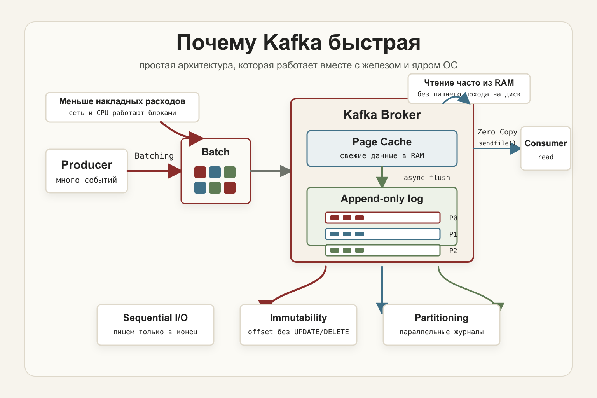

Когда разработчики впервые слышат, что Kafka обрабатывает миллионы сообщений в секунду, кажется, что внутри скрываются сложные алгоритмы или хранение всего в оперативном объёме памяти. 

На самом деле секрет производительности кроется в простоте архитектуры, которая устраняет лишние операции и не борется с физикой железа.

## 1. Последовательная запись вместо случайной (Sequential I/O)

Большинство традиционных баз данных используют случайную запись (`Random Write`), обновляя записи по разным адресам (`UPDATE`, `DELETE`), что заставляет накопители постоянно перемещать головку диска или фрагментировать блоки SSD. Это создает микропаузы, которые замедляют систему.

Kafka работает иначе:
* **Append-only log:** новые сообщения всегда добавляются строго в конец файла.
* **Эффективность дисков:** накопители (как HDD, так и SSD) работают на максимальных скоростях именно при непрерывном потоке последовательных данных.

Отказ от произвольных вставок и обновлений убирает лишние накладные расходы на дисковые операции.

## 2. Page Cache операционной системы

Kafka не хранит всё в оперативной памяти (иначе терабайты данных привели бы к мгновенному переполнению RAM), но и не читает каждый раз с медленного физического диска. 

Механизм работает на уровне ядра ОС:
1. При записи данные сначала попадают в **Page Cache** (оперативную память) и сбрасываются на диск асинхронно.
2. Когда `Consumer` запрашивает свежие сообщения, они с высокой вероятностью считываются **напрямую из RAM**, минуя дисковые обращения.

Благодаря этому чтение данных из Kafka по скорости сопоставимо с in-memory хранилищами.

## 3. Batching (Батчинг сообщений)

Обработка каждого сообщения по отдельности через сеть создает огромные накладные расходы на открытие соединений, передачу заголовков и CPU-таймауты.

* `Producer` и `Broker` объединяют пачки сообщений в батчи (`Batch`).
* Вместо тысяч одиночных запросов система передает укрупненные блоки данных, снижая нагрузку на сеть и процессор.

## 4. Параллелизм через Partitioning

Топики в Kafka делятся на партиции (`Partition`), каждая из которых представляет собой независимый последовательный журнал.

* Несколько партиций позволяют **параллельно** записывать и читать данные с участием разных брокеров.
* Масштабирование пропускной способности достигается линейно по мере добавления партиций (если нет дисбаланса из-за «горячих» ключей).

## 5. Неизменяемость данных (Immutability)

Записанный в Kafka лог изменить нельзя. У каждого сообщения есть фиксированный `Offset`. 

Отсутствие мутабельности дает архитектурные преимущества:
* Нет необходимости в блокировках (locks) при конкурентном доступе.
* Упрощаются репликация и восстановление после сбоев.

## 6. Zero Copy

При передаче данных потребителям (`Consumer`) Kafka задействует системный вызов ядра `sendfile()`. 

Это позволяет пересылать данные из файлового кэша ОС напрямую в сетевой сокет, минуя промежуточное копирование в память пользовательского процесса. В результате снижается нагрузка на CPU и ускоряется доставка трафика.

---

### Архитектурные причины высокой скорости

| Механизм | Влияние на производительность |
| :--- | :--- |
| **Append-only log** | Исключает операции `UPDATE` и `DELETE` |
| **Sequential I/O** | Максимальная скорость работы дисковой подсистемы |
| **Page Cache** | Большинство чтений и записей обрабатываются в RAM |
| **Batching** | Минимальные сетевые накладные расходы |
| **Partitioning** | Параллелизм на уровне брокеров и потоков |
| **Immutability** | Отсутствие блокировок и накладных расходов на изменения |
| **Zero Copy** | Прямая передача данных из кэша в сеть без лишних копирований |

Сочетание этих элементов превращает Kafka в высокопроизводительную платформу потоковой обработки на стандартном железе.

---

## Что дальше?

Мы разобрали технические основания производительности Kafka. В следующей части перейдем к концептуальному вопросу: чем Kafka отличается от классических очередей сообщений и почему её используют как полноценную streaming-платформу.
