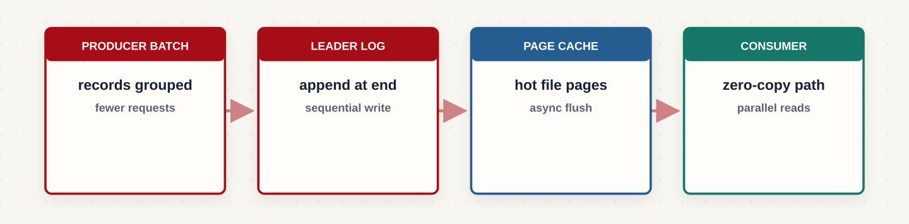
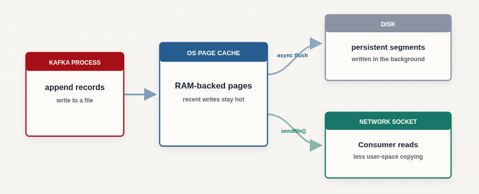
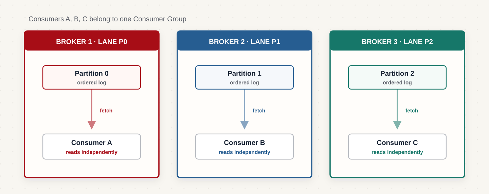

Когда разработчики впервые слышат, что Kafka обрабатывает миллионы сообщений в секунду, кажется, что внутри скрываются сложные алгоритмы или хранение всех данных в оперативной памяти.

Мне нравится разбирать производительность Kafka именно через путь сообщения: так видно, на каких операциях система экономит время и ресурсы. Высокая пропускная способность складывается из нескольких решений, которые помогают эффективно использовать сеть, процессор, память и накопители.

Наш интернет-магазин продолжает расти: поток заказов увеличивается, а одни и те же события нужно записать, реплицировать на другие Broker и передать нескольким сервисам. Проследим путь события `PaymentCompleted` для заказа `48291`: сначала Producer отправит его вместе с другими записями, затем Leader добавит их в журнал, реплики скопируют данные, а сервис склада прочитает событие и начнёт сборку заказа.

На каждом участке этого пути Kafka сокращает накладные расходы. При этом фоновый сброс на диск, репликация и чтение могут происходить параллельно.

## 1. Producer собирает сообщения в Batch

Каждому запросу к Kafka нужны служебные заголовки, обработка на Broker и, в зависимости от `acks`, ответ с подтверждением. Если отправлять каждое маленькое сообщение отдельным запросом, эти расходы будут повторяться снова и снова.

Чтобы уменьшить их, Producer собирает сообщения для одной Partition в Batch и отправляет их вместе. Один запрос к Broker может содержать несколько батчей для разных Partition.

Например, во время распродажи в `orders.events` поступают тысячи событий заказов. Событие об оплате заказа `48291` может отправиться в одном батче с событиями других заказов, попавших в ту же Partition. Служебные расходы распределяются между несколькими сообщениями, поэтому сеть и процессор используются эффективнее.

Накопление батча регулируют `batch.size` — его целевой размер в байтах — и `linger.ms` — время ожидания дополнительных сообщений. Если батч заполняется раньше, Producer отправляет его без ожидания окончания этого интервала. Так можно повысить пропускную способность ценой небольшой задержки перед отправкой. Обратите внимание на этот компромисс: обработать больше сообщений в секунду и быстрее доставить одно сообщение — не одно и то же.

Батч направляется на Broker, где находится текущий Leader выбранной Partition. Следующая задача — эффективно добавить полученные данные в журнал.

## 2. Leader дописывает данные в конец журнала

Как мы уже знаем, каждая Partition представляет собой append-only log. Новые записи добавляются в конец текущего файла-сегмента. Когда сегмент достигает заданного размера, Kafka создаёт следующий и продолжает запись в него.

При добавлении батча Kafka не нужно изменять ранее записанные сообщения или освобождать место между ними. Данные записываются последовательно, а объединение сообщений в батчи уменьшает количество мелких операций ввода-вывода.

В реляционных базах данных обновление таблиц и индексов может требовать записи в разные участки файлов. Последовательные журналы применяются и в СУБД, но там дополнительно нужно поддерживать структуры таблиц и индексов. В Kafka основной поток записи в журнал остаётся последовательным.

Последовательная запись особенно эффективна на HDD, а пакетная запись полезна и для SSD. Но запись в файл не означает, что каждое сообщение немедленно попадает на физический накопитель: между Kafka и накопителем работает файловый кэш ОС.

## 3. Page Cache связывает запись и чтение

Kafka хранит сообщения в файлах, а операционная система использует свободную оперативную память для кэширования их содержимого. Этот файловый кэш называется Page Cache.

При записи данные сначала попадают в Page Cache. ОС затем сохраняет их на накопитель, обычно в фоновом режиме. Содержимое файлов при этом может оставаться в памяти и использоваться для чтения.

Followers запрашивают новые записи у Leader и добавляют их в свои журналы. Доступные для чтения сообщения получают и Consumer. Этим операциям не обязательно ждать фонового сброса данных на накопитель: репликация, чтение и сброс могут идти параллельно. Подтверждение записи зависит от `acks` и репликации; оно само по себе не означает немедленного физического сохранения данных на диске.

Если сервис склада читает событие `PaymentCompleted` вскоре после его появления, нужные данные часто уже находятся в Page Cache. Тогда Kafka отдаёт их без дополнительного чтения с накопителя. Если Consumer возвращается к старой истории и нужных данных в кэше нет, ОС читает их с накопителя.

Поэтому Kafka может хранить терабайты сообщений, используя RAM для ускорения доступа к активно читаемой части журнала.

Почему Kafka полагается на файловый кэш ОС, а не создаёт собственный кэш сообщений в JVM, объясняется в разделе [Don't fear the filesystem!](https://kafka.apache.org/41/design/design/#dont-fear-the-filesystem).

## 4. Неизменяемость упрощает репликацию и чтение

Пока новые записи добавляются в журнал, другие участники системы читают уже доступные данные. Такой доступ проще организовать благодаря неизменяемости сообщений.

После добавления записи в Partition её содержимое нельзя отредактировать через API Kafka. Запись получает Offset — позицию внутри журнала, которая не меняется в течение жизни записи.

Если нужно исправить ранее отправленные данные, приложение публикует новое событие. Например, после события «адрес доставки указан» магазин отправляет событие «адрес доставки изменён».

Это свойство помогает на нескольких участках пути:

- Followers копируют новые записи лидера, сохраняя их порядок и offsets. Им не приходится согласовывать изменения содержимого уже записанных сообщений.
- Склад, уведомления и аналитика могут независимо читать одни и те же записи. Им не нужно блокировать сообщение, чтобы защитить его от одновременного редактирования.
- Пока записи сохраняются в Kafka, приложение может вернуться к предыдущему offset и прочитать их заново, например для восстановления своего состояния после сбоя.

Здесь я бы не делал вывод «значит, в Kafka вообще нет блокировок». Неизменяемость упрощает модель работы с самими записями: данные дописываются, а уже записанное содержимое остаётся стабильным. Но внутренним структурам Kafka по-прежнему нужна синхронизация.

Теперь посмотрим, как Kafka передаёт эти данные из файлового кэша по сети.

## 5. Zero-copy сокращает копирование при передаче

При обычной отправке файла приложение сначала читает данные в свою память, а затем передаёт их операционной системе для отправки в сетевой сокет. Данные лишний раз копируются между памятью ядра и памятью приложения.

Kafka может использовать механизм zero-copy, который на Linux реализуется через `sendfile()`. Он позволяет передавать содержимое файлового кэша ОС в сетевой сокет без промежуточного копирования в память процесса Kafka. Это уменьшает объём копирования и нагрузку на CPU при передаче данных из Kafka в приложение-получатель.

Получается, Page Cache помогает избежать повторного чтения с накопителя, а zero-copy сокращает лишнее копирование при отправке уже доступных данных. Название zero-copy не означает полного отсутствия копирования: речь об устранении промежуточных копий.

Как укрупнение запросов и сокращение копирования данных снижают накладные расходы, описано в разделе [Efficiency](https://kafka.apache.org/41/design/design/#efficiency).

До сих пор мы следили за сообщениями одной Partition. Чтобы увеличить общую пропускную способность, Kafka позволяет выполнять этот путь параллельно для нескольких журналов.

## 6. Partition позволяют выполнять работу параллельно

Топик в Kafka делится на Partition, каждая из которых представляет собой отдельный последовательный журнал. Producer собирает отдельные батчи для каждой Partition, а их лидеры могут находиться на разных Broker. Поэтому запись и чтение распределяются между несколькими серверами и обработчиками.

Например, события заказов распределены по шести Partition. В одной Consumer Group могут работать шесть Consumer: каждый читает свою Partition и обрабатывает заказы параллельно с остальными. Если Consumer всего три, каждому можно назначить по две Partition. Седьмой Consumer останется без работы, поскольку каждую Partition внутри группы одновременно читает только один Consumer.

При этом события заказа `48291` продолжают попадать в одну Partition по ключу `orderId`. Другие заказы могут обрабатываться параллельно, а для нашего заказа сохраняется порядок записи.

Увеличение количества Partition даёт больше возможностей для параллельной обработки, но не гарантирует пропорционального роста производительности. Если Broker уже исчерпали ресурсы или большая часть сообщений попадает в одну Partition, добавление Partition само по себе проблему не решит.

## Что дальше?

Теперь видно, как механизмы работают вместе. Producer укрупняет отправку, Leader дописывает данные в журнал через Page Cache, реплики копируют записи, а Consumer читает их с минимальными накладными расходами. Несколько Partition позволяют выполнять эту работу параллельно, а неизменяемость записей упрощает работу всех участников.

Далее посмотрим, как использовать эту модель при проектировании приложения: когда передавать задачи, когда публиковать события и как выбирать топики, ключи и правила хранения.
