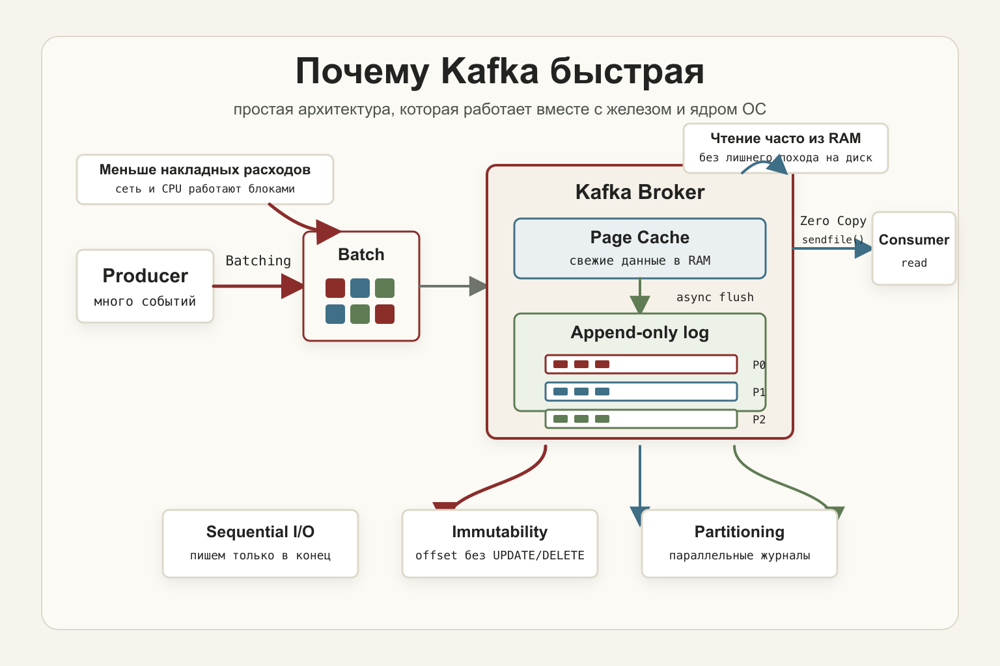

Когда разработчики впервые слышат, что Kafka обрабатывает миллионы сообщений в секунду, кажется, что внутри скрываются сложные алгоритмы или хранение всего в оперативном объёме памяти. 

На самом деле секрет производительности кроется в простоте архитектуры, которая устраняет лишние операции и не борется с физикой железа.

## 1. Последовательная запись вместо случайной (Sequential I/O)

В реляционных базах данных обновление таблиц и индексов может требовать записи в разные участки файлов. Kafka добавляет новые сообщения в конец журнала партиции, поэтому основной поток записи остаётся последовательным. Такой подход помогает эффективно записывать большие объёмы данных. Последовательные журналы применяются и в СУБД, но там дополнительно нужно поддерживать структуры таблиц и индексов.

Kafka хранит сообщения в журнале каждой партиции. Новые записи добавляются в конец текущего файла-сегмента. Когда сегмент достигает заданного размера, Kafka создаёт следующий и продолжает запись в него.
Такой подход называют `append-only log` (мы уже говорили про него ранее). При добавлении сообщения Kafka не нужно изменять ранее записанные сообщения или освобождать место между ними. Это позволяет записывать данные последовательно и объединять сообщения в крупные пакеты, снижая накладные расходы на операции ввода-вывода.
Последовательная запись особенно эффективна на HDD, а пакетная запись полезна и для SSD. Вместе эти механизмы помогают Kafka поддерживать высокую пропускную способность.

## 2. Page Cache операционной системы

Kafka хранит сообщения в файлах, а операционная система использует свободную оперативную память для кэширования их содержимого. Этот файловый кэш называется `Page Cache`.

При записи сообщения данные сначала попадают в `Page Cache`. ОС затем сохраняет их на накопитель, обычно в фоновом режиме. После этого данные могут оставаться в памяти и использоваться для чтения.

Если consumer читает сообщения вскоре после их появления, нужные данные часто уже находятся в кэше. Тогда Kafka отдаёт их без дополнительного чтения с накопителя. Например, событие о новом заказе может быть записано в журнал и через несколько миллисекунд передано сервису уведомлений из того же `Page Cache`.

Поэтому Kafka может хранить терабайты сообщений, используя RAM для ускорения доступа к активно читаемой части журнала.

## 3. Batching (Батчинг сообщений)

Каждому запросу к Kafka нужны служебные заголовки, обработка на брокере и, в зависимости от acks, ответ с подтверждением. Если отправлять каждое маленькое сообщение отдельным запросом, эти расходы будут повторяться снова и снова.

Чтобы уменьшить их, producer собирает сообщения для одной партиции в `Batch` и отправляет их вместе. Один запрос к брокеру может содержать несколько батчей для разных партиций. 

Например, во время распродажи приложение отправляет тысячи событий просмотра товаров. Вместо отдельного запроса на каждый просмотр producer может собрать десятки событий в батч. Служебные расходы распределяются между всеми сообщениями, поэтому сеть и процессор используются эффективнее.

Непосредственно накопление батча регулируют `batch.size` — его целевой размер в байтах — и `linger.ms` — время ожидания дополнительных сообщений. Если батч заполняется раньше, `producer` отправляет его без ожидания окончания этого интервала. Так можно повысить пропускную способность ценой небольшой задержки перед отправкой.

## 4. Параллелизм через Partitioning

Как мы уже говорили,- топик в Kafka делится на партиции, каждая из которых представляет собой отдельный последовательный журнал. Это позволяет распределить запись и чтение между несколькими брокерами и консьюмерами.

Например, события заказов распределены по шести партициям. В одной consumer group могут работать шесть consumers: каждый читает свою партицию и обрабатывает заказы параллельно с остальными. Если consumers всего три, каждому можно назначить по две партиции. Седьмой consumer останется без работы, поскольку каждую партицию внутри группы одновременно читает только один consumer.

Лидеры партиций также могут находиться на разных брокерах, распределяя нагрузку на запись. Увеличение количества партиций даёт больше возможностей для параллельной обработки, но не гарантирует пропорционального роста производительности. Если брокеры уже исчерпали ресурсы или большая часть сообщений попадает в одну партицию, добавление партиций само по себе, конечно, проблему не решит.

## 5. Неизменяемость данных (Immutability)

После добавления сообщения в партицию его содержимое нельзя отредактировать через API Kafka. Сообщение получает Offset — номер позиции внутри этой партиции, который не меняется в течение жизни записи.

Если нужно исправить ранее отправленные данные, приложение публикует новое сообщение. Например, после события "адрес доставки указан" можно отправить событие "адрес доставки изменён".

Такой подход упрощает работу с потоком:

- Независимое чтение. Consumers могут читать одни и те же записи, каждый со своей позиции. Им не нужно блокировать сообщение, чтобы защитить его от одновременного редактирования.
- Репликация. Followers копируют новые записи лидера, сохраняя их порядок и offsets. Им не приходится согласовывать изменения содержимого уже записанных сообщений.
- Повторная обработка. Пока записи сохраняются в Kafka, приложение может вернуться к предыдущему offset и прочитать их заново, например чтобы восстановить своё состояние после сбоя.

## 6. Zero Copy

При обычной отправке файла приложение сначала читает данные в свою память, а затем передаёт их операционной системе для отправки в сетевой сокет. Данные лишний раз копируются между памятью ядра и памятью приложения.

Kafka может использовать механизм zero-copy, который на Linux реализуется через sendfile(). Он позволяет передавать содержимое файлового кэша ОС в сетевой сокет без промежуточного копирования в память процесса Kafka. Это уменьшает объём копирования и нагрузку на CPU, повышая пропускную способность при передаче сообщений consumers.

Название zero-copy не означает полного отсутствия копирования: речь об устранении лишних промежуточных копий.

## Что дальше?

Мы разобрали технические основания производительности Kafka и поняли, как сочетание этих элементов превращает Kafka в высокопроизводительную платформу потоковой обрабработки. 

В следующей части перейдем к концептуальному вопросу: чем Kafka отличается от классических очередей сообщений и почему её используют как полноценную streaming-платформу.
