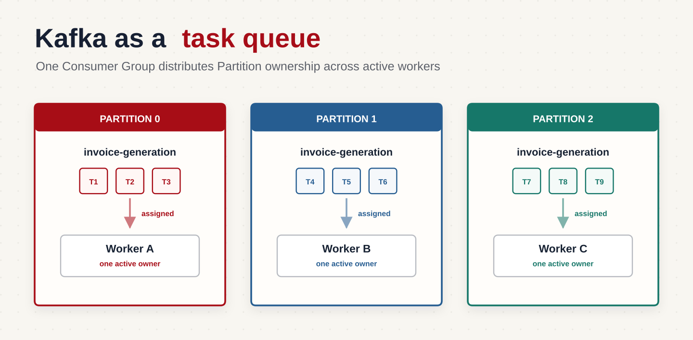
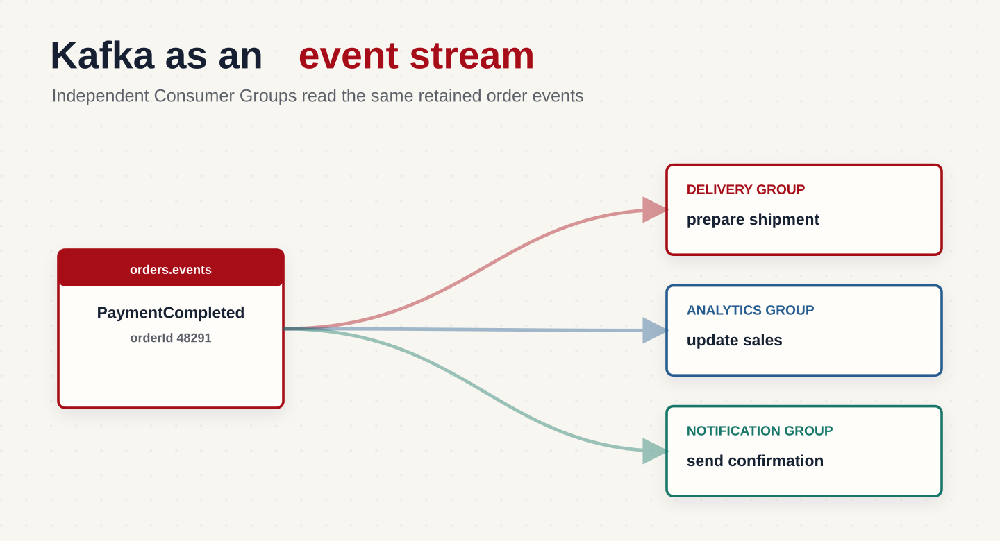
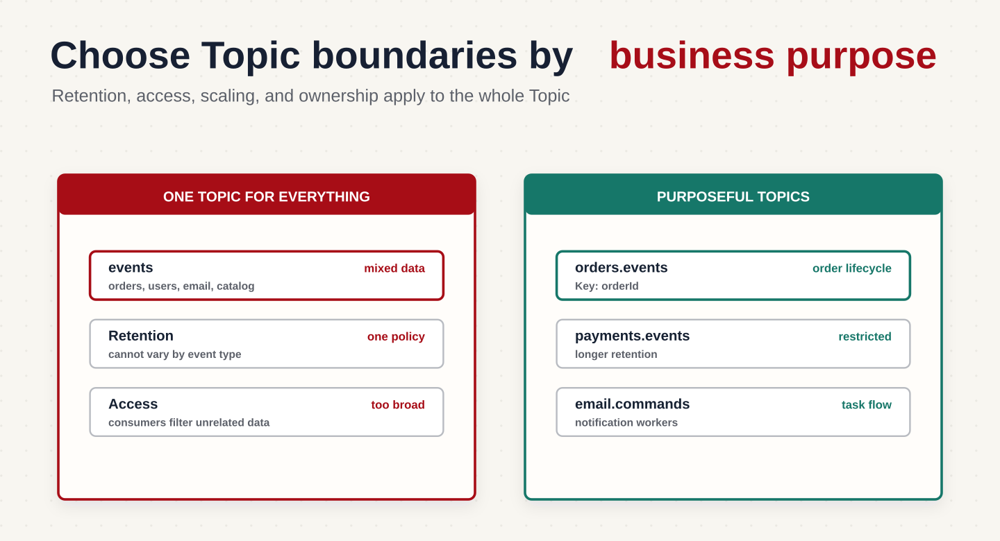
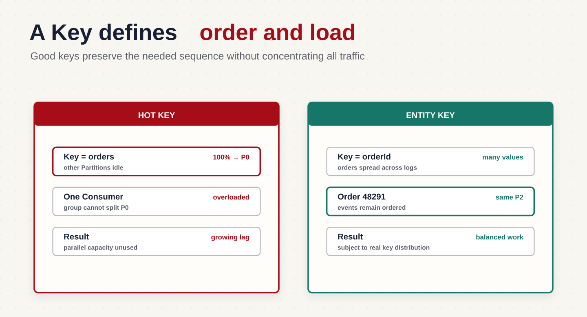

В предыдущих частях мы разобрали, как Kafka хранит сообщения, копирует их между Broker и достигает высокой пропускной способности. Теперь посмотрим, как использовать эти свойства при проектировании приложения.

Вернёмся к нашему интернет-магазину. До сих пор мы в основном следили за событиями одного заказа. Но через Kafka магазин передаёт и другие данные: задачи на формирование счетов, события об оплате и изменения каталога. Технически всё это сообщения, но назначение у них разное. Поэтому им могут понадобиться разные топики, ключи, сроки хранения и правила обработки.

Здесь я предлагаю ненадолго отложить настройки и начать с вопросов к самому приложению. Что мы передаём? Кому это нужно? Для каких событий важен порядок? Ответив на них, мы с вами выберем границы топиков, ключи и количество Partition, а не просто набор чисел в конфигурации.

## Kafka в роли очереди задач

Допустим, после покупки нужно сформировать PDF-счёт. Сервис заказов отправляет задачу, а один из свободных обработчиков выполняет её. Такие обработчики обычно называют воркерами.

В Kafka воркеры объединяются в Consumer Group. Каждую Partition внутри группы в конкретный момент читает только один Consumer. Так задачи распределяются между участниками группы:



Если задач стало больше, чем воркеры успевают обработать, они остаются в журнале. Например, во время распродажи поступило 10 000 запросов на счета, а обработчики успели выполнить только 2 000. Остальные можно прочитать позже, пока не истёк срок хранения.

После успешной обработки Consumer фиксирует текущую позицию чтения — выполняет commit offset. Для каждой назначенной Partition позиция хранится отдельно. Само сообщение при этом остаётся в Kafka.

Однако распределение Partition не гарантирует, что бизнес-операция выполнится ровно один раз. Если воркер сформировал счёт и упал до сохранения offset, другой воркер может получить ту же задачу повторно. Обработка должна учитывать такие повторы.

Кроме того, Kafka не выбирает свободного воркера для каждого отдельного сообщения: она назначает ему Partition целиком. Если один счёт формируется долго, следующие задачи этой Partition могут ждать. Поэтому для очереди задач нужно отдельно продумать повторы, длительную обработку и ошибки.

## Kafka как поток событий

Теперь возьмём знакомое событие `PaymentCompleted` — «оплата завершена». Оно сообщает о факте, который уже произошёл.

Этот факт нужен сразу нескольким сервисам:



Каждый сервис использует свою Consumer Group. Поэтому доставке, аналитике и уведомлениям доступны одни и те же события, а позиции чтения у них независимы.

Если аналитика остановилась на час, сервис доставки продолжает работать. После запуска аналитика читает пропущенные события со своей сохранённой позиции, если они ещё находятся в Kafka.

Именно здесь полезна потоковая модель: один сервис публикует факт, а другие независимо решают, что с ним делать. Позже к тому же потоку можно подключить нового Consumer, например сервис рекомендаций.

## Очередь задач и поток событий

Разница прежде всего в назначении сообщения.

| Характеристика | Очередь задач | Поток событий |
| :--- | :--- | :--- |
| Что передаём | Просьбу выполнить действие | Факт о произошедшем |
| Пример | Сформировать счёт | Заказ оплачен |
| Кто обрабатывает | Ожидаемый исполнитель, воркеры одной группы | Несколько заинтересованных сервисов со своими группами |
| Что отслеживаем | Выполнена ли задача | До какой позиции каждый сервис обработал поток |
| Можно ли читать повторно | Да, пока запись хранится в Kafka | Да, пока запись хранится в Kafka |

Срок хранения действует в обеих моделях. Kafka не ждёт, пока все задачи будут выполнены или все группы прочитают события, прежде чем удалить старые записи.

Один поток событий может при этом запускать фоновые задачи. Например, сервис уведомлений читает `PaymentCompleted` и отправляет письмо. Для него это работа, но исходное сообщение остаётся фактом об оплате, доступным и другим сервисам.

## Сначала определите назначение сообщения

Перед созданием топика я рекомендую сформулировать назначение сообщения одной фразой. Мы просим выполнить действие или сообщаем о том, что уже произошло? От этого зависит, кто отвечает за обработку и какой смысл получатель должен извлечь из сообщения.

### Команда

Команда просит выполнить действие: `GenerateInvoice`, `SendEmail`, `ReserveInventory`.

Например, сервис заказов отправляет `GenerateInvoice` сервису биллинга. У команды есть ожидаемый исполнитель, а результат нужно отслеживать: счёт сформирован или задача завершилась ошибкой.

Если несколько независимых групп прочитают команду и каждая выполнит действие, можно получить несколько счетов вместо одного. Поэтому число исполнителей и правила повторной обработки должны быть частью контракта.

### Событие

Событие фиксирует результат: `OrderCreated`, `PaymentCompleted`, `UserRegistered`.

Например, сервис платежей публикует `PaymentCompleted` после успешной оплаты. Он отвечает за достоверность этого факта. Сервис доставки решает начать сборку заказа, аналитика учитывает продажу, а уведомления отправляют письмо.

Такое разделение уменьшает зависимость отправителя от получателей: сервису платежей не нужно знать обо всех будущих подписчиках.

### Технический поток

Через Kafka также передают логи приложений, метрики, аудит и изменения строк базы данных. Последний сценарий называют `CDC` (`Change Data Capture`): изменения в базе превращаются в поток сообщений.

Здесь требования определяются назначением данных. Отладочные логи могут иметь короткий срок хранения, аудит — длительный. Для некоторых метрик допустимы пропуски, а для потока изменений базы они могут нарушить состояние системы-получателя.

Поэтому «технические сообщения» не означают автоматически «некритичные». Для каждого потока нужно определить допустимую потерю данных, срок хранения и требования к порядку.

## Не создавайте один Topic для всего

Когда тип сообщения понятен, нужно выбрать, какие сообщения будут жить в одном топике.

На старте удобно создать общий `events` и отправлять туда всё:

Но топик имеет общие настройки хранения и доступа. Если отладочные события достаточно хранить сутки, а платёжные — месяц, внутри одного топика настроить эти сроки по типу сообщения не получится.

Есть и другие последствия. Сервис обновления каталога будет получать вместе с нужными событиями поток заказов и пользователей. Ему придётся фильтровать лишнее, а права на чтение топика откроют доступ ко всем этим данным.

Обычно удобнее разделять потоки по бизнес-назначению:



Так для платежей можно отдельно задать права доступа и срок хранения, а для каталога — увеличить число Partition при росте нагрузки.

Разделение не изолирует ресурсы Broker автоматически: разные топики могут работать на одних машинах. Но оно позволяет управлять потоками независимо.

## Но Topic на каждый тип события — тоже не всегда хорошо

Можно пойти в другую крайность и создать отдельный топик для каждого изменения заказа:

```text
order-created
order-paid
order-cancelled
order-shipped
order-delivered
```

Если сервису доставки нужна полная последовательность изменений заказа, ему придётся читать несколько топиков. Порядок между ними Kafka не гарантирует: событие об оплате может быть обработано раньше события о создании.

Если у событий одинаковые требования к доступу и хранению, часто удобнее объединить их в `orders.events`, использовать `orderId` как ключ и указывать тип внутри сообщения:

```json
{
  "eventType": "PaymentCompleted",
  "eventId": "5c72a8f1",
  "orderId": "48291",
  "occurredAt": "2026-08-06T09:30:00Z",
  "data": {
    "amountMinor": 1599000,
    "currency": "RUB"
  }
}
```

Если же один тип событий содержит чувствительные данные или требует другого срока хранения, отдельный топик может быть оправдан.

Граница топика должна следовать требованиям потока. Само количество типов сообщений не даёт готового ответа.

## Как именовать Topics

До этого мы использовали короткое имя `orders.events`, чтобы не отвлекаться от устройства Kafka. Для production договоримся о более полном формате, который сразу показывает область системы и назначение потока:

```text
<domain>.<entity>.<message-type>
```

Тогда имена будут выглядеть так:

```text
commerce.orders.events
commerce.payments.events
identity.users.events
notifications.email.commands
```

`commerce` обозначает область системы, `orders` — объект, а `events` — назначение сообщений. Это соглашение команды, а не обязательный формат Kafka.

Главное — применять его последовательно. Смесь `payment_events_v2`, `UserUpdateTopic` и `email-queue-prod-new` затрудняет поиск и со временем делает имена неоднозначными.

## Как выбрать Key

После выбора топика нужно решить, как распределять его сообщения между Partition.

При обычной маршрутизации Producer использует хеш ключа Key для выбора Partition. При неизменном числе Partition и одинаковых правилах маршрутизации сообщения с одинаковым ключом попадают в одну Partition.

Это позволяет сохранять порядок для конкретного объекта и распределять разные объекты между обработчиками.

### Пример с заказами

Для событий заказа естественным ключом будет `orderId`. Ключ передаётся как отдельная часть записи Kafka, а не просто поле внутри JSON:

```text
Key: 48291
Value: {"eventType": "PaymentCompleted", "orderId": "48291"}
```

Если события публикуются последовательно, журнал одной Partition будет содержать:

```text
OrderCreated -> PaymentCompleted -> DeliveryStarted -> OrderDelivered
```

Другие заказы с другими ключами могут попасть в другие Partition и обрабатываться параллельно.

Kafka сохраняет порядок записи в Partition. Она не восстанавливает бизнес-порядок по времени события: если разные сервисы отправили сообщения в обратной последовательности, одинаковый ключ сам по себе это не исправит.

Consumer тоже должен учитывать порядок. Если он запускает обработку всех сообщений одновременно, позднее событие может завершиться раньше предыдущего.

### Пример с пользователями

Для изменений профиля можно использовать `userId`. Тогда `EmailChanged`, `PasswordChanged` и `UserBlocked` одного пользователя попадут в одну Partition.

Выбирать ключ нужно по объекту, для которого важен порядок. Если требуется последовательность действий внутри заказа, используйте идентификатор заказа; если внутри профиля — идентификатор пользователя.

### Плохой ключ: константа

Если у всех сообщений ключ `orders`, они попадут в одну Partition:



Номер занятой Partition здесь условный. Проблема в том, что остальные простаивают, даже если в кластере много Broker и Consumer. Перегруженную Partition называют **hot partition**, или горячей Partition.

### Плохой ключ: поле с малым количеством значений

Допустим, ключ — статус заказа: `created`, `paid` или `cancelled`.

Всего три разных ключа задействуют не более трёх Partition, а при совпадении результатов маршрутизации — ещё меньше. Кроме того, события одного заказа с разными статусами могут попасть в разные Partition.

Такой ключ одновременно ограничивает распределение нагрузки и не обеспечивает нужный порядок.

### Плохой ключ: текущее время

Время отправки может дать много разных значений ключа, но события одного заказа будут распределяться по разным Partition:

```text
OrderCreated     -> Partition 1
PaymentCompleted -> Partition 4
DeliveryStarted  -> Partition 0
```

Для аналитики, которой порядок отдельных заказов не важен, это может быть допустимо. Для последовательного изменения состояния заказа такой ключ не подходит.

Если порядок вообще не требуется, можно отправлять сообщения без ключа и использовать распределение Producer. Придумывать искусственный ключ только ради наличия поля не нужно.

## Как избежать горячей Partition

Даже ключ с большим количеством значений может создавать перекос. Допустим, наш магазин стал маркетплейсом и начал принимать товары от разных продавцов. Если поток использует `sellerId` как ключ, события одного крупного продавца могут составить половину всех сообщений.

Все его события попадают в одну Partition. Другие Consumer свободны, но внутри группы они не могут разделить чтение этой Partition между собой.

Сначала нужно уточнить, действительно ли требуется общий порядок всех событий продавца.

### Выбрать более точный объект

Если порядок нужен только внутри заказа, вместо `sellerId` лучше использовать `orderId`.

Заказы крупного продавца смогут распределяться по разным Partition, а события каждого заказа останутся вместе. Это часто позволяет убрать перекос без усложнения обработки.

### Использовать составной ключ

Если идентификатор продавца нужно сохранить в ключе, можно добавить номер группы — shard:

```text
seller-1-0
seller-1-1
seller-1-2
```

Например, номер shard вычисляется из `orderId`. Тогда события одного заказа получают одинаковый составной ключ, а разные заказы распределяются между несколькими ключами.

Разные ключи могут попасть в разные Partition, хотя равномерное распределение нужно проверить. Общего порядка всех событий продавца уже не будет: он сохранится только внутри каждой Partition.

### Разделить поток

Особенно крупного продавца можно вынести в отдельный топик с собственными настройками.

Это помогает отдельно управлять нагрузкой, но один неизменный ключ и в новом топике будет направлять сообщения в одну Partition. Чтобы получить параллелизм, всё равно нужно изменить границу порядка или способ распределения.

Если строгий порядок всех событий продавца действительно обязателен, произвольно разделить их между обработчиками нельзя. Придётся ускорять последовательную обработку или пересматривать это требование.

## Сколько Partition создавать

Ключ определяет распределение сообщений, а число Partition — доступный параллелизм чтения внутри одной Consumer Group.

При четырёх Partition одновременно читать их смогут максимум четыре участника группы:

```text
Partition 0 -> Consumer A
Partition 1 -> Consumer B
Partition 2 -> Consumer C
Partition 3 -> Consumer D
```

Пятый Consumer останется без назначенных Partition. Другие группы могут независимо читать этот же топик своими Consumer.

Число Partition выбирают с учётом скорости записи, обработки, размера сообщений, ресурсов Broker и роста нагрузки.

### Простой подход к расчёту

Я рекомендую начинать этот расчёт с нагрузочного теста реальной обработки, а не только скорости чтения из Kafka. Если Consumer после чтения обращается к базе, именно это обращение может определять его пропускную способность. Предположим, тест показал: один Consumer с нашей бизнес-логикой обрабатывает 5 000 сообщений в секунду. Ожидаемый поток — 40 000 сообщений в секунду.

```text
40 000 / 5 000 = 8 consumers
```

Для восьми Consumer одной группы нужно хотя бы восемь Partition. Но это расчёт без запаса: если поток вырастет или один обработчик остановится, группа начнёт отставать.

Можно проверить вариант с 12 или 16 Partition и достаточным числом Consumer. Сами по себе дополнительные Partition производительность не создают: Broker, сеть и база приложения должны выдержать суммарную нагрузку.

Расчёт также предполагает достаточно равномерное распределение. Горячая Partition может отставать даже при низкой общей загрузке.

### Почему нельзя просто создать тысячу Partition

У каждой реплики Partition есть файлы журнала, индексы и служебное состояние. Например, 1 000 Partition с `replication.factor=3` означают 3 000 реплик, распределённых по Broker.

Больше реплик — больше файлов и метаданных, работы по репликации и управлению лидерами. Назначение Partition Consumer и восстановление после отказов тоже могут занимать больше времени.

Отдельное сетевое соединение на каждую Partition не требуется: запросы к одному Broker могут обслуживать несколько Partition. Но остальные расходы никуда не исчезают.

Поэтому количество Partition нужно проверять на своей нагрузке, оставляя обоснованный запас.

### Планируйте рост заранее

Kafka позволяет увеличить число Partition существующего топика. Уменьшить его на месте нельзя: для этого обычно создают новый топик и организуют перенос данных.

При увеличении числа Partition может измениться маршрутизация по ключу. Упрощённо она выглядит так:

```text
partition = hash(key) % partition_count
```

После перехода с четырёх Partition на восемь новое сообщение того же заказа может попасть в другую Partition. Старые записи Kafka автоматически не переносит.

Если Consumer читают обе Partition параллельно, новое событие может быть обработано раньше старого. Для потоков со строгим порядком по ключу такое изменение требует плана перехода. [Подробнее о добавлении партиций](https://github.com/apache/kafka/blob/trunk/docs/operations/basic-kafka-operations.md).

## Итог

Для магазина мы определили, какие сообщения являются командами, а какие — событиями. События жизненного цикла заказа объединили в один топик, выбрали `orderId` как ключ и связали количество Partition с нагрузкой и скоростью обработки.

Перед запуском такого потока проверьте четыре вещи:

- понятно, кто публикует сообщения и какой результат от них ожидается;
- границы топика соответствуют назначению данных и потребностям получателей;
- ключ сохраняет нужный порядок и не собирает основную нагрузку в одной горячей Partition;
- число Partition проверено нагрузочным тестом с запасом на рост и отказы.

## Что дальше?

Теперь у событий есть маршрут, но нужно ещё определить, сколько хранить историю и как менять формат сообщений, не ломая получателей. Далее разберём retention, compaction и контракты событий.
