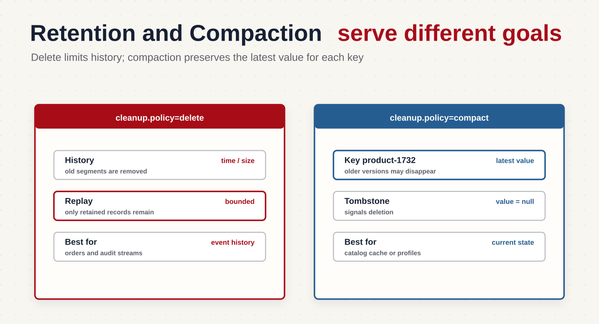
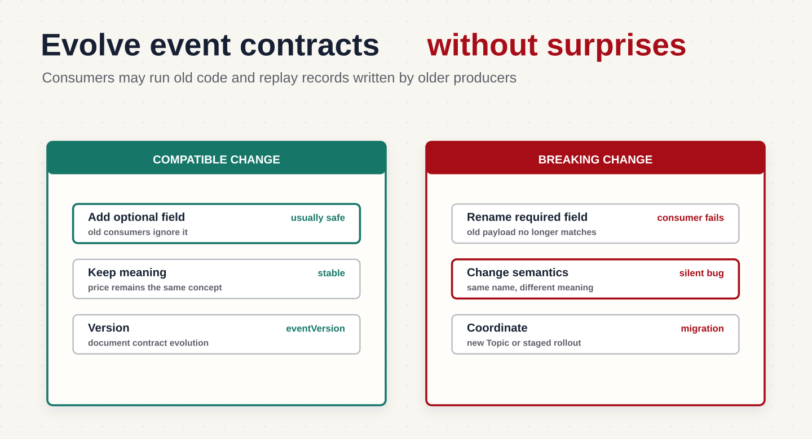
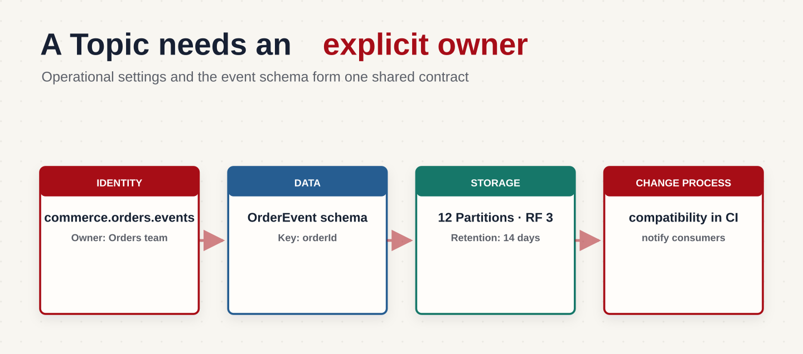

Ранее мы выбрали для магазина топики, ключи и количество Partition. События одного заказа попадают в один журнал, а разные заказы могут обрабатываться параллельно.

Теперь у магазина появляются новые требования. Аналитике нужно пересчитывать продажи за прошлую неделю, сервис каталога хранит локальный кэш, а команда заказов хочет добавлять поля в события без одновременного обновления всех получателей.

Мне кажется полезным поставить здесь простой вопрос: сможет ли новый или долго не работавший Consumer разобраться в нашем потоке? Для этого ему нужны и доступная история, и понятный формат событий. Давайте разберём обе стороны, а затем соберём принятые решения в контракт топика и определим ответственного за него.

## Retention: сколько хранить сообщения

Когда распределение нагрузки выбрано, нужно решить, сколько времени сообщения должны оставаться доступными. Политику хранения называют Retention.

Это напрямую влияет на восстановление. Если Consumer не работал три дня, а сообщения хранятся только сутки, часть пропущенных событий уже будет удалена. Возврат к старому offset не вернёт эти данные.

То же ограничение действует для Replay, с которым мы познакомились ранее. Чтобы аналитика магазина могла пересчитать продажи за прошлую неделю, события за эту неделю должны оставаться в Kafka. Сохранённая позиция чтения сама по себе не защищает записи от удаления.

При выборе срока хранения я рекомендую учитывать не только время простоя, но и время, за которое Consumer догонит поток после запуска. Он ведь не останется один на один со старой очередью: новые сообщения продолжат приходить.

Для выбора срока хранения полезно выяснить:

- как долго Consumer может оставаться недоступным;
- сколько времени ему потребуется, чтобы обработать накопившиеся сообщения;
- нужно ли пересчитывать историю;
- можно ли восстановить события из другого источника;
- сколько места доступно и какие ограничения действуют на хранение данных.

### Хранение по времени

Для удаления старых записей используют `cleanup.policy=delete`. Например, семь дней хранения задаются так:

```properties
cleanup.policy=delete
retention.ms=604800000
```

Kafka удаляет данные целыми файлами-сегментами. Поэтому сообщение не обязательно исчезнет ровно через семь дней: удаление зависит от возраста сегмента и фоновой проверки.

Такой срок может подойти для потока просмотров товаров, если аналитика обычно читает его сразу, а команде нужна возможность пересчитать статистику за последнюю неделю.

### Хранение по размеру

`retention.bytes` ограничивает объём журнала одной Partition. Если для топика с десятью Partition задан лимит 10 GiB, ориентир для одной копии всего топика — 100 GiB.

При трёх репликах суммарный объём журналов по кластеру будет примерно втрое больше. Дополнительно нужны место для индексов и запас: удаление происходит сегментами, лимит не является точной границей занятого места.

Если одновременно заданы ограничения по времени и размеру, Kafka может удалить старые сегменты при достижении любого из них. Поэтому лимит размера способен сократить доступную историю раньше выбранного срока. [Настройки хранения Kafka](https://kafka.apache.org/38/configuration/topic-level-configs/).

### Log Compaction

Для некоторых потоков важна не вся история, а последнее известное состояние каждого объекта. Например, сервис каталога магазина хранит локальный кэш карточек товаров: ему нужны актуальные названия и цены, а не все предыдущие версии.



Для этого можно использовать `cleanup.policy=compact` — компакцию журнала. Она работает по ключу сообщения:

```text
Offset 0: product-1732 -> name=Кружка, price=1500
Offset 1: product-2840 -> name=Термос, price=3000
Offset 2: product-1732 -> name=Кружка, price=1200
```

После фоновой очистки старая версия карточки `product-1732` может быть удалена:

```text
Offset 1: product-2840 -> name=Термос, price=3000
Offset 2: product-1732 -> name=Кружка, price=1200
```

Порядок оставшихся записей и их offsets сохраняются. Компакция не происходит мгновенно: Consumer может увидеть несколько версий одного ключа и должен применять их последовательно.

Для удаления объекта отправляют запись с его ключом и значением `null`. Её называют `tombstone`: для Consumer это сигнал удалить объект из своего состояния. Такая запись тоже хранится ограниченное время, поэтому правила восстановления кэша нужно учитывать отдельно.

В этом примере каждая запись содержит полное состояние карточки, а `price` задаётся в рублях. Поэтому последняя запись по ключу позволяет восстановить актуальные данные. Компакция также подходит для полного состояния профилей, конфигураций и некоторых CDC-потоков. Если сообщение содержит только изменение вроде «прибавить 100 бонусов», сохранение последней записи не восстановит итоговый баланс. В таком случае нужна история изменений или отдельный поток полного состояния. [Описание компакции Kafka](https://kafka.apache.org/41/design/design/).

## Проектируйте формат события

Теперь у нас есть топик, ключ, Partition и политика хранения. Осталось договориться, что именно находится внутри сообщения.

Ранее мы показывали упрощённый JSON с `orderId`, `status` и `price`, чтобы разобраться в устройстве записи Kafka. Для рабочего потока магазина этого мало: получателю нужно знать, какой факт произошёл, когда, какой сервис его опубликовал и как распознать повторную доставку.

Поэтому добавим в JSON общие сведения о событии, а бизнес-данные поместим в поле `data`. Вместе они образуют контракт между отправителем и получателями. Вся эта структура по-прежнему находится внутри Value: Kafka хранит её как байты и сама не проверяет смысл полей.

Например, для события создания того же заказа формат может выглядеть так:

```json
{
  "eventId": "0ae2342d-105d-45ad-8d91-441b7115afbc",
  "eventType": "OrderCreated",
  "eventVersion": 1,
  "occurredAt": "2026-08-06T09:30:00Z",
  "producer": "order-service",
  "data": {
    "orderId": "48291",
    "userId": "1732",
    "amountMinor": 1599000,
    "currency": "RUB"
  }
}
```

Здесь `eventType` описывает факт, `occurredAt` — время, когда он произошёл, а producer — сервис-источник. `amountMinor` хранит сумму в минимальных единицах валюты: для RUB это копейки. Единицы измерения нужно явно описать в контракте.

`occurredAt` не обязательно совпадает с timestamp записи Kafka. Например, событие произошло в 12:00, а из-за временной недоступности Kafka было отправлено в 12:05. Отдельное поле позволяет сохранить бизнес-время независимо от настроек временной метки Kafka.

### Зачем нужен Event ID

При повторной доставке Consumer может получить событие ещё раз. `eventId` позволяет понять, что это тот же факт, а не новая операция.

Например, сервис бонусов получает `PaymentCompleted` и начисляет баллы. Перед повторным начислением он проверяет идентификатор события.

Идентификатор нужно сохранять при повторных отправках того же события. Если при каждом retry генерировать новый `eventId`, получатель не сможет распознать дубль.

Кроме того, проверка идентификатора и изменение баланса должны быть согласованы, например выполнены в одной транзакции базы. Само наличие поля в JSON не делает обработку идемпотентной.

### Зачем нужна версия события

Со временем формат меняется. Например, простое поле суммы заменяется объектом:

```json
{
  "amount": {
    "valueMinor": 1599000,
    "currency": "RUB"
  }
}
```

Старый Consumer может ожидать `amountMinor` и не понимать новый формат. `eventVersion` помогает явно выбрать нужный обработчик или преобразование.

Но увеличение номера версии не исправляет несовместимость автоматически. Сначала нужно подготовить Consumer к новому формату, а затем начать его публиковать. При повторном чтении истории им могут встретиться обе версии.

### Не меняйте смысл существующего поля

Допустим, `price` хранит рубли:

```json
{"price": 1500}
```

После обновления Producer начинает передавать в том же поле копейки:

```json
{"price": 150000}
```

Тип поля не изменился, поэтому Consumer может продолжить работу и посчитать цену в сто раз больше.

Именно поэтому я бы не ограничивался проверкой «JSON по-прежнему разбирается». Приложение не упало, но считает неверные суммы — такую ошибку сложнее заметить. Лучше ввести новое поле с явным смыслом, например `amountMinor`, и согласовать переход с получателями.

### Предпочитайте совместимые изменения

Предположим, в событие заказа добавляется `deliveryComment`. Если старые Consumer игнорируют неизвестные поля, а новые допускают отсутствие комментария в старых событиях, сервисы можно обновлять постепенно.



Совместимость нужно проверять в обе стороны:

- понимает ли новый Consumer старые сообщения, оставшиеся в Kafka;
- понимает ли старый Consumer новые сообщения, которые уже публикует Producer.

Добавление необязательных полей и значений по умолчанию часто помогает. Удаление используемого поля, изменение типа или превращение необязательного поля в обязательное может нарушить контракт.

Конкретные правила зависят от формата и реализации читателей: изменение JSON, Avro или Protobuf нельзя оценивать только по внешнему виду.

### Когда нужен Schema Registry

Если один поток читают несколько сервисов, устной договорённости о полях становится мало. Нужна машиночитаемая схема: например, Avro, Protobuf или JSON Schema.

Schema Registry — отдельный сервис, который хранит схемы и проверяет их совместимость при регистрации новых версий. Он не является встроенным валидатором всех записей Kafka: приложения должны использовать соответствующие средства сериализации и проверки.

Основные режимы совместимости:

- `BACKWARD`: новый Consumer с новой схемой может читать данные предыдущей схемы;
- `FORWARD`: Consumer с предыдущей схемой может читать данные новой схемы;
- `FULL`: выполняются оба требования.

Например, при `BACKWARD` сначала можно обновить Consumer, сохранив возможность читать старые сообщения, а затем Producer. Если требуется перечитывать всю историю с несколькими версиями схем, нужна проверка совместимости со всеми предыдущими версиями, например `BACKWARD_TRANSITIVE`.

Схема помогает обнаруживать структурные несовместимости, но не заменяет описание смысла полей. Смена рублей на копейки может пройти проверку типов и всё равно сломать бизнес-логику. [Подробнее о совместимости схем](https://docs.confluent.io/platform/7.7/schema-registry/fundamentals/schema-evolution.html).

## Документируйте владельца Topic

Даже хорошо спроектированный поток трудно сопровождать, если неизвестно, кто за него отвечает.

Для каждого топика полезно сохранить небольшую карточку:



Числа в примере условные: они должны следовать из нагрузки и требований восстановления.

Такая карточка помогает понять, с кем согласовать изменение схемы, можно ли сократить срок хранения и кто пострадает при удалении топика. Её нужно обновлять вместе с изменением потока.

## Контрольный список перед запуском

Перед созданием топика проверьте, что команда может ответить на основные вопросы.

| Область | Что выяснить |
| :--- | :--- |
| Назначение | Это команда, событие или технический поток? Кто публикует и кто обрабатывает? |
| Порядок | Для какого объекта он нужен? Какой ключ используем? Возможны ли горячие ключи? |
| Нагрузка | Сколько данных поступает? Как быстро работают Consumer? Какой запас ресурсов нужен? |
| Хранение | Сколько длится допустимый простой? Успеют ли Consumer догнать поток до удаления данных? |
| Контракт | Есть ли стабильный eventId, понятные единицы измерения и проверка совместимости? |
| Эксплуатация | Кто владеет топиком? Кто реагирует на ошибки и рост отставания Consumer? |

Это не требует большого архитектурного документа. Но решения должны быть явными: иначе каждый сервис начнёт делать собственные предположения о порядке, времени хранения и смысле полей.

## Итог

Retention определяет, какая история остаётся доступной после простоя или для повторного чтения. Compaction помогает хранить последнее известное состояние по ключу, когда полная история изменений не нужна.

Формат события — это договорённость между Producer и Consumer. Для заказа `48291` получатель должен понимать тип события, время, идентификатор и смысл бизнес-полей. Версия и Schema Registry помогают развивать структуру, но не заменяют согласование смысла данных.

## Что дальше?

Мы договорились, как хранить и описывать события. Далее проследим путь заказа при сбоях: что делать, если отправитель не получил подтверждение, и как избежать пропуска или повторного выполнения бизнес-операции.
