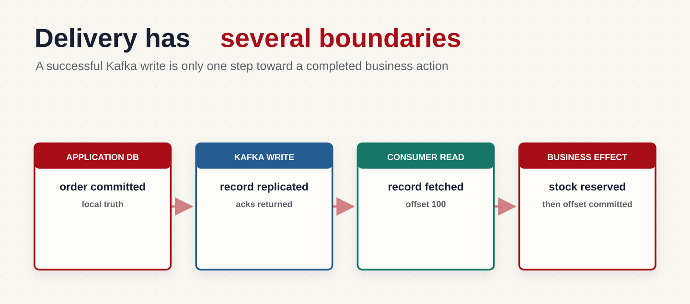
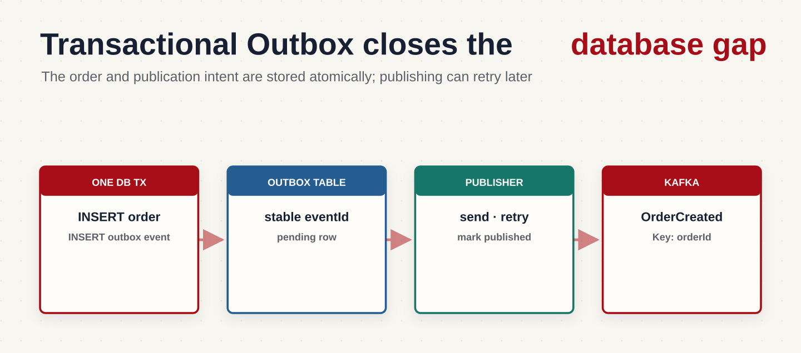
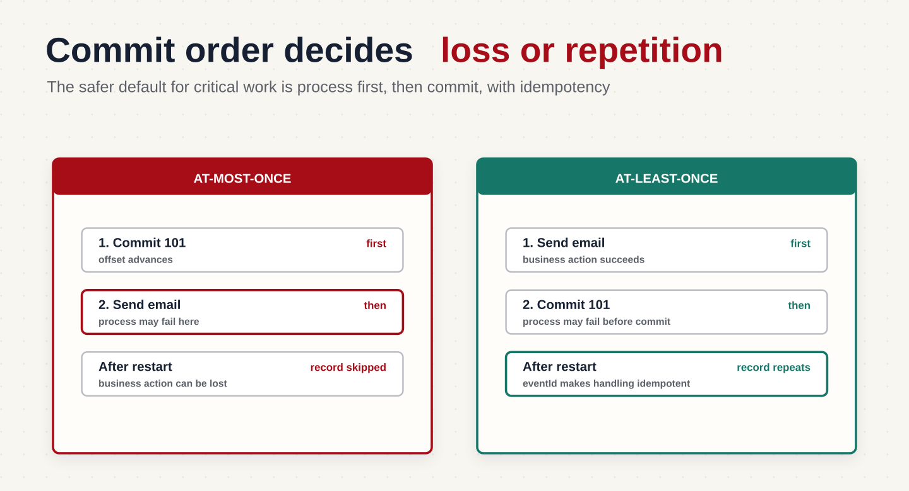

Мы определили формат событий магазина, срок хранения и правила изменения схемы. Теперь проследим путь заказа `48291` от базы приложения до результата работы получателя.

После создания заказа сервис публикует `OrderCreated`, а после оплаты сервис платежей отправляет `PaymentCompleted`. Склад резервирует товар, сервис бонусов начисляет баллы. Между любыми двумя действиями может произойти сбой: запись в базе уже сохранена, событие ещё не отправлено, подтверждение потерялось или Consumer упал после изменения баланса.

В этой части я предлагаю проверять каждую гарантию одним вопросом: «А что, если процесс упадёт прямо сейчас?». Мы с вами пройдём четыре участка: публикацию из базы, запись в Kafka, обработку события и сохранение позиции чтения.

## Гарантии доставки: что именно гарантирует Kafka

Когда слышу «сообщение доставлено», мне хочется уточнить: куда именно? Kafka сохранила запись, Consumer получил её или приложение уже выполнило бизнес-операцию? Это разные этапы, и от ответа зависит, какую гарантию мы обсуждаем.



Например, Kafka подтвердила событие об оплате, но сервис склада ещё не прочитал его. Или прочитал, но не смог зарезервировать товар из-за ошибки базы.

Параметр `acks` определяет условия подтверждения записи в Kafka. Репликация помогает пережить отказ Broker. Если при отправке возникает временная ошибка, Producer повторно отправляет сообщение.

Успешную обработку на складе нужно организовать отдельно: выбрать момент сохранения offset, учесть повторные сообщения и предусмотреть восстановление после ошибок. Даже `acks=all` не гарантирует, что заказ будет собран или письмо отправлено.

## Producer: подтверждение записи и повторы

Для события об оплате заказа возьмём уже знакомую связку репликации и `acks=all`, добавив защиту от появления дублей при повторных попытках отправки:

```text
Topic:
  replication.factor=3
  min.insync.replicas=2

Producer:
  acks=all
  enable.idempotence=true
```

Напомним: запись подтверждается после репликации в текущем ISR, в котором должно оставаться минимум две реплики. Если все три реплики входят в ISR, подтверждения нужны от всех трёх, а не от любых двух. [Описание настройки Kafka](https://kafka.apache.org/43/generated/topic_config.html).

Эта связка повышает устойчивость к отказу отдельного Broker, но не защищает от любого сочетания аварий. Кроме того, `acks=all` само по себе не требует немедленного `fsync` на накопителях: данные могут ещё находиться в файловом кэше ОС. [Запись и сброс кэша](https://kafka.apache.org/25/operations/hardware-and-os/).

Теперь посмотрим, что видит отправитель при сбое. Для него важно не только сохранить событие, но и узнать результат отправки: запись может попасть в Kafka, а подтверждение — потеряться по дороге.

### Что происходит, если подтверждение не пришло

Допустим, лидер записал событие, но сетевое соединение оборвалось до получения ответа Producer. Отправитель видит ошибку, хотя сообщение уже может находиться в Kafka.

Таймаут означает, что результат неизвестен. Поэтому повторная отправка нужна, но может создать дубль.

Если Producer повторно отправляет запрос после временной ошибки, `enable.idempotence=true` позволяет Kafka распознать его и не добавить вторую запись. Этот режим требует совместимых настроек, в частности `acks=all` и включённых retries.

Он не устраняет любую повторную публикацию бизнес-события. Если приложение заново вызывает отправку того же события, например после перезапуска, для Producer это может быть новая запись. Поэтому получателям всё равно нужен стабильный `eventId`.

В Java-клиенте Producer отправка обычно асинхронная: успешный возврат из `send()` ещё не означает успешную запись в Kafka. Приложение должно проверять результат через callback или future и обрабатывать окончательную ошибку.

Время автоматических попыток ограничено, в частности, `delivery.timeout.ms`. Если отправка так и не завершилась, событие нужно сохранить для последующей публикации, а ошибку — показать в мониторинге. [Настройки producer](https://kafka.apache.org/37/configuration/producer-configs/).

## Transactional Outbox: как связать базу приложения и Kafka

Даже надёжная запись в Kafka не решает проблему двух отдельных операций: изменения базы и отправки события.

Представим, что сервис заказов сначала сохраняет заказ в PostgreSQL, а затем публикует `OrderCreated`. Если приложение упадёт между этими действиями, заказ останется в базе, но склад и уведомления о нём не узнают.

Если поменять порядок, появляется другая ошибка: событие уже опубликовано, а транзакция базы откатилась. Получатели начинают работать с заказом, которого нет.

Для таких случаев используют **Transactional Outbox**. Приложение в одной транзакции базы сохраняет и заказ, и событие в отдельную таблицу outbox:



Либо сохраняются обе записи, либо ни одна. Событие получает `eventId` уже здесь, и этот идентификатор сохраняется при всех попытках публикации.

Отдельный процесс читает outbox и отправляет события в Kafka. После подтверждения он помечает запись отправленной. Если Kafka временно недоступна, событие остаётся в базе и может быть опубликовано позже.

Возможен и повтор: процесс отправил событие, но упал до отметки об успехе. После запуска он отправит его снова. Поэтому outbox решает проблему согласованного сохранения заказа и намерения опубликовать событие, а Consumer должен уметь распознавать дубли.

Вместо периодического чтения таблицы можно использовать CDC, например Debezium: изменения outbox будут поступать в Kafka через коннектор. В обоих вариантах нужно следить, что публикация действительно работает и очередь событий не растёт бесконечно. [Пример outbox с Debezium](https://debezium.io/blog/2019/02/19/reliable-microservices-data-exchange-with-the-outbox-pattern/).

## Consumer: когда сохранять Offset

Событие попало в Kafka. Теперь Consumer должен выполнить действие и сохранить позицию, с которой группа продолжит чтение после перезапуска.

Эту операцию называют `commit offset`. Для каждой Partition сохраняется offset следующей записи, которую нужно прочитать. Например, после успешной обработки записи 100 можно сохранить позицию 101.

Offset — это позиция группы, а не удаление сообщения и не подтверждение бизнес-операции самой Kafka.



### At-most-once: сначала Offset, потом обработка

Представим сервис уведомлений: Consumer получил событие с offset 100, сохранил следующую позицию 101, начал отправлять письмо и упал до завершения операции.

После перезапуска группа продолжит с позиции 101. Событие 100 может оставаться в Kafka, но обычное восстановление группы его пропустит.

Такой порядок называют `at-most-once`: допускается пропуск обработки. Для обязательного уведомления об оплате это обычно неподходящее поведение.

### At-least-once: сначала обработка, потом Offset

Теперь поменяем последовательность: Consumer сначала успешно отправляет письмо, но падает до сохранения позиции 101. После перезапуска он снова получает событие с offset 100.

Обработка повторится. Это модель `at-least-once`: при восстановлении возможны повторные попытки обработки.

Для многих бизнес-сценариев это удобнее, но повтор не должен повторно списывать деньги или начислять бонусы. Поэтому такую модель сочетают с идемпотентной обработкой.

Чтобы приложение само управляло моментом commit, в Java-клиенте Consumer используют `enable.auto.commit=false`. Одного флага недостаточно: код должен сохранять позицию только после успешной обработки соответствующих записей. [Документация consumer](https://kafka.apache.org/26/javadoc/org/apache/kafka/clients/consumer/KafkaConsumer.html).

### Где применяется Exactly-once

Если процесс читает события из Kafka, преобразует их и пишет результат обратно в Kafka, транзакции позволяют атомарно записать результат и зафиксировать позицию чтения входных сообщений.

Например, обработчик прочитал оплату и сформировал событие для аналитики. В одной транзакции он публикует результат и сохраняет входную позицию. Получатели с `isolation.level=read_committed` читают только записи завершённых транзакций.

При корректной организации такой обработки повтор после сбоя не создаёт второй видимый результат в выходном потоке. Но обращение к внешнему платёжному API или изменение PostgreSQL не становится частью транзакции Kafka автоматически. Для этих действий нужны собственные механизмы согласования и защиты от повторов. [API транзакционного producer](https://kafka.apache.org/30/javadoc/org/apache/kafka/clients/producer/KafkaProducer.html).

## Consumer должен быть идемпотентным

Идемпотентная обработка означает, что повтор того же события не создаёт дополнительный бизнес-эффект.

Допустим, за оплату заказа нужно начислить 100 бонусов. Consumer обновил баланс и упал до commit offset. После запуска он снова получает событие оплаты.

Если просто повторить прибавление, покупатель получит 200 бонусов. Поэтому я рекомендую проверять обработчик не только на первом получении события, но и на втором: что изменится, если подать ему то же сообщение ещё раз? В нашем примере сервис хранит идентификаторы обработанных событий, чтобы не начислять бонусы повторно.

Для PostgreSQL последовательность может быть такой:

```text
1. Начать транзакцию базы
2. Попробовать добавить eventId в processed_events
3. Если eventId новый, начислить бонусы
4. Зафиксировать транзакцию
5. Только после этого сохранить offset в Kafka
```

В таблице нужен уникальный ключ по `event_id`. Вставка может выглядеть так:

```sql
INSERT INTO processed_events (event_id)
VALUES ('0ae2342d-105d-45ad-8d91-441b7115afbc')
ON CONFLICT (event_id) DO NOTHING
RETURNING event_id;
```

Если вставка вернула идентификатор, событие новое и можно выполнить начисление. Если не вернула строку, оно уже обработано. Проверка и начисление должны выполняться в одной транзакции.

Если начисление завершилось ошибкой, транзакция откатывается вместе с записью идентификатора. Следующая попытка сможет обработать событие заново.

Для внешнего API локальной транзакции недостаточно. Например, при запросе к платёжному сервису можно передать стабильный ключ идемпотентности, если API его поддерживает. Тогда повтор запроса не создаст ещё одно списание. Если такой возможности нет, придётся отдельно проверять результат операции и проектировать восстановление.

## Итог

Для надёжной обработки заказа нужны согласованные решения на всём пути. Outbox сохраняет бизнес-данные вместе с намерением опубликовать событие. Producer проверяет результат отправки и при временной ошибке повторяет запрос без создания дублей в Kafka. Consumer сохраняет offset после успешной обработки и распознаёт повторные события по стабильному `eventId`.

Даже если Kafka подтвердила запись `PaymentCompleted`, это ещё не означает, что склад зарезервировал товар. Результат бизнес-операции контролирует приложение.

## Что дальше?

Мы знаем, как учитывать сбои между отдельными действиями. Но попытка обработки может завершаться ошибкой снова и снова. Далее разберём, когда повторять сообщение, когда отправлять его в DLQ и как заметить, что поток перестал справляться с нагрузкой.
